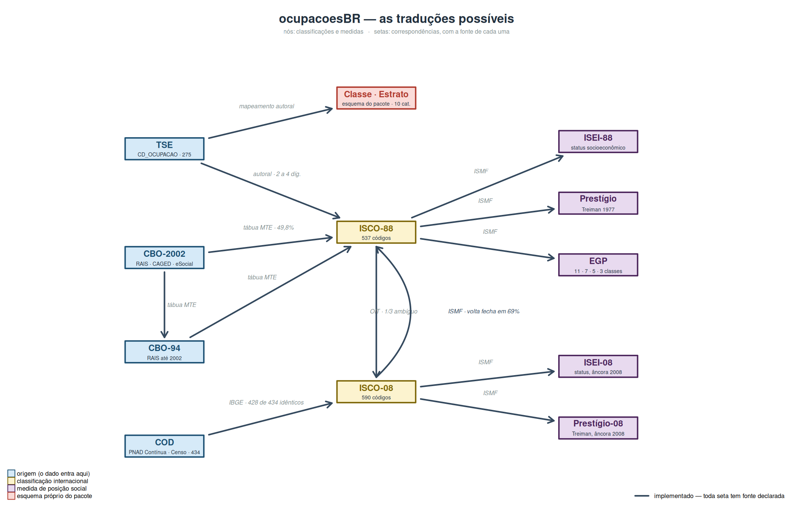

<!-- README.md é GERADO. Edite README.Rmd e rode devtools::build_readme(). -->

```{r, include = FALSE}
knitr::opts_chunk$set(collapse = TRUE, comment = "#>")
```

# ocupacoesBR

Traduz a **ocupação declarada nas candidaturas ao TSE** em classificações
padronizadas e medidas de posição social: ISCO-88, ISCO-08, ISEI, prestígio de
Treiman, EGP e um esquema de classes e estratos desenhado para o dado eleitoral
brasileiro.

```r
# install.packages("remotes")
remotes::install_github("moraespeixoto/ocupacoesBR")
```

```{r moldura, include = FALSE}
library(ocupacoesBR)
# um recorte com os nomes de coluna que o TSE usa, para os exemplos abaixo
dados <- data.frame(
  ANO_ELEICAO = c(2026L, 2026L, 2026L, 2026L, 1998L),
  CD_OCUPACAO = c("131", "601", "298", "999", "214"),
  DS_CARGO    = c("DEPUTADO FEDERAL", "DEPUTADO ESTADUAL", "SENADOR",
                  "DEPUTADO ESTADUAL", "DEPUTADO FEDERAL")
)
```

## O uso normal: uma coluna nova no seu banco

Você passa a coluna inteira e recebe a coluna traduzida, alinhada linha a linha.
Não há loop, não há tradução código a código, e o seu banco não muda de tamanho.

```{r uso-normal, message = FALSE}
library(dplyr)

dados <- dados |> mutate(isei = tse_para_isei(CD_OCUPACAO, ano = ANO_ELEICAO))

dados
```

Em R base, a mesma coisa:

```r
dados$isei <- tse_para_isei(dados$CD_OCUPACAO, ano = dados$ANO_ELEICAO)
```

O `ano` também é uma coluna, e é o que resolve a quebra de cadastro de 2002: na
linha de 1998, o código 214 era **delegado de polícia**, e só a partir de 2002
passou a ser **escultor e pintor**. Sem o `ano`, aquela linha receberia
calada o escore de escultor. Com ele, o pacote devolve `NA` e avisa.

Para trazer **todas** as medidas de uma vez, junte o dicionário inteiro em vez
de chamar uma função por régua:

```{r uso-join}
dados |>
  left_join(crosswalk_tse(), by = c(CD_OCUPACAO = "cod_tse")) |>
  select(CD_OCUPACAO, rotulo, isco88, isei88, siops88, egp, classe, qualidade)
```

Uma ressalva, que a própria saída acima demonstra: a junção usa o cadastro
corrente e **não** aplica o `ano`. Compare a última linha nas duas tabelas. É o
mesmo código 214 declarado em 1998: com `ano`, o `mutate()` devolveu `NA` e
avisou; na junção, ele virou escultor e pintor com ISEI 54, em silêncio. A
junção serve para uma safra só, ou para um recorte que não atravesse 2002; numa
série longa, use o `mutate()`.

## O mapa das traduções



Cada seta é uma correspondência com **fonte declarada**. A do TSE para a ISCO-88
é a única autoral — e é por isso que ela carrega os rótulos e a régua de
qualidade: é a parte que ninguém pode conferir contra um documento oficial.

## Por onde começar

Duas vinhetas, e a primeira importa mais que a documentação de qualquer função:

- **`vignette("qual-regua")`** — o pacote oferece quatro medidas com a mesma
  facilidade, e elas **não são intercambiáveis**. Esta vinheta é sobre escolher,
  e sobre os sete erros que as pessoas cometem, na ordem em que os cometem.
- **`vignette("validacao")`** — a medida se sustenta contra critério externo?
  Patrimônio declarado e escolaridade, que não entram na sua construção.

## O problema que ele resolve

O TSE publica a ocupação de cada candidatura como um código de um cadastro
próprio, sem correspondência publicada com nenhuma classificação internacional.
Quem quer estudar classe, status ou desigualdade no recrutamento político tem de
construir essa ponte sozinho — e quase todo mundo a constrói do jeito errado.

```{r}
library(ocupacoesBR)

tse_para_isco(c(111, 169, 257))

tse_para_isei(c(111, 169, 257))

tse_para_classe(c(111, 169, 291))
```

Tudo é vetorizado: as funções aceitam um código ou milhões deles.

## A armadilha do primeiro dígito

Este é o erro que o pacote existe para impedir. É tentador traduzir ocupação
pelo primeiro dígito, já que CBO e ISCO têm dez grandes grupos cada. **Isso
inverte classes inteiras:**

| Grande grupo 9 | Significado | ISEI típico |
|---|---|---|
| CBO (Brasil) | reparação e manutenção — mecânicos, eletricistas | ~34 |
| ISCO (internacional) | ocupações elementares — serventes, ajudantes | 16–30 |

Quem traduz por um dígito manda o mecânico para o fundo da escala. A tradução
válida é, no mínimo, a dois dígitos — que é o nível em que este pacote opera,
descendo a três ou quatro onde dois fundiriam posições distantes demais (médico
e enfermeiro moram os dois no grupo 22, e o ISEI os separa em dezenas de pontos).

Há testes automatizados sobre o **dicionário** que quebram se essa propriedade
se perder (`tests/testthat/test-armadilha.R`). Uma versão anterior deles
inspecionava apenas a tábua do Ganzeboom e por isso não podia detectar erro de
mapeamento — sabotar 253 dos 275 códigos deixava a suíte passando.

## Quanto vale cada tradução

Nem toda linha do dicionário tem o mesmo lastro. Metade das candidaturas é
traduzida a dois dígitos, e um quinto dos códigos tem mais de um destino
possível na ISCO-08. O `crosswalk_tse()` diz isso na cara:

```{r}
table(crosswalk_tse()$qualidade, useNA = "ifany")
```

`exata` é tradução a quatro dígitos com ponte unívoca; `agregada` é a dois
dígitos, um ISEI que é média de grupo; `ambígua` é onde a OIT define mais de um
destino. Publicar as três com a mesma tipografia esconde erro de medida que **não
é ruído**: ele é correlacionado com o estrato, porque foram as ocupações de topo
que receberam refinamento.

## Verifique a cobertura antes de analisar

O modo silencioso de errar uma medida de classe não é classificar mal um caso: é
um código novo cair num rótulo residual sem ninguém perceber. Na primeira versão
deste dicionário, 76 códigos reais caíam em "fora da PEA" — inclusive
proprietários, que sumiam justamente da categoria onde mais importam.

```{r}
checa_cobertura(tse_isco$cod_tse)
```

Ela **falha com erro**, em voz alta, em vez de devolver um resultado plausível e
errado.

### A safra de 2026 já está coberta

O dicionário vai de 1998 a 2026. A eleição em curso não trouxe **nenhum código
novo**: os 211 códigos que aparecem nas candidaturas de 2026 são subconjunto dos
275 que o pacote já cobria, com a mesma grafia que vigora desde 2018.

```{r}
table(tse_diff_cadastro(2024, 2026)$mudanca)
```

Nenhum criado. Os "extintos" são armadilha de leitura, e a documentação da
função explica: a vigência se constrói do rótulo observado, e 2026 é uma safra
geral — sem prefeito nem vereador — que ainda está **aberta**, com o Tribunal
julgando registros. Código raro sem candidato registra ausência, não revogação.
Traduzir 2026 com este pacote, porém, não é extrapolação.

## O EGP, e a posição no emprego que o dicionário conhece

O EGP não é função só da ocupação: as suas regras exigem a posição na ocupação e
o número de subordinados. O formulário do TSE não pergunta nenhum dos dois.

Mas dez códigos do TSE **nomeiam** o proprietário no próprio rótulo —
comerciante, empresário, pecuarista, proprietário de estabelecimento —, e o
dicionário os marca. Essa marca é exatamente o `SEMPL` que as sintaxes do ISMF
pedem, e o pacote a usa por padrão:

```{r}
tse_para_egp(c(111, 169, 601), avisar = FALSE)
```

Sem ela, o `169` (comerciante) cairia em **II**, a classe de serviço assalariada
— a pequena burguesia contada como classe de serviço. O que continua
indeterminado é a divisão entre IVa e IVb, que exige o número de subordinados:

```{r}
tse_para_egp(c(111, 169, 601))
```

**Para publicar, prefira `n_classes = 7` ou `5`**, onde IVa e IVb se fundem em
IVab. Com as variáveis em mãos, o esquema funciona por inteiro:

```{r}
isco88_para_egp(c("5220", "5220"),
                conta_propria = c(TRUE, TRUE),
                n_supervisionados = c(0, 5))
```

Use `isco88_para_egp()` com qualquer dado em ISCO-88, não só com o do TSE.

## A perna CBO

Quem trabalha com RAIS, CAGED ou eSocial não tem código do TSE — tem **CBO**.
É a segunda porta de entrada do pacote, e ela leva ao mesmo lugar:

```{r}
cbo2002_para_isco(c("1111-05", "225120"))

cbo2002_para_isei(c("1111-05", "225120"))
```

Os três formatos são aceitos: `"1111-05"`, `"111105"` e `111105`.
Para microdado anterior a 2003, `cbo94_para_isco()` e `cbo94_para_isei()`.

### O dado administrativo é sujo, e o pacote aguenta

O layout da RAIS declara que `-1` — com ou sem zeros à esquerda — significa
"ignorado". O Novo CAGED usa `999999`, e grava a CBO como número, de modo que
`010105` chega como `10105`. Nada disso derruba a chamada:

```{r}
suppressWarnings(cbo2002_para_isco(c("225120", "-1", "0000-1", "999999")))
```

O código sujo volta `NA` com aviso. O erro fica reservado ao caso em que
**nenhum** valor é válido — que é quando, de fato, a coluna está errada.

### Duas ressalvas que o pacote não esconde

**A correspondência é oficial, e incompleta.** Ela vem da tábua de conversão
CBO2002–CBO94–CIUO88 do Ministério do Trabalho, consultada família a família.
Mas essa tábua é, por construção, uma conversão *entre a CBO-2002 e a CBO-94*:
só cobre as ocupações que existem nas duas. Ocupações criadas na revisão de 2002
— e todo o grande grupo 0, das forças armadas — **não têm correspondência
oficial com a CIUO-88**, e a função devolve `NA` em vez de inventar um destino
plausível. Contra o domínio oficial da CBO-2002 (2.777 ocupações), a cobertura é
de cerca de **metade**.

**A família de quatro dígitos é uma agregação, não um código.** Quando você passa
uma família, o pacote devolve o ISCO majoritário entre as suas ocupações.
Pergunte antes se a família é homogênea:

```{r}
cbo2002_concordancia(c("5211", "4121", "3171"))
```

`concordancia` só recebe valor quando `cobertura_familia` vale 1 — isto é,
quando a tábua viu a família **inteira**, o que ocorre em 175 das 436. A família
`3171` acima foi vista por uma ocupação entre quatro: dizer que ela é homogênea
seria afirmar certeza máxima sobre evidência mínima. A proporção entre as
ocupações vistas fica em `concordancia_vista`, sem posar de diagnóstico.

Em 19 famílias a moda não é maioria. Aí não há destino majoritário, e o padrão é
`NA`:

```{r}
emp <- cbo2002_familia_isco88$familia[cbo2002_familia_isco88$empate][1]
suppressWarnings(cbo2002_para_isco(emp))
cbo2002_para_isco(emp, empate = "moda")
```

## A perna do IBGE: PNAD Contínua e Censo

Quem trabalha com pesquisa domiciliar não tem código do TSE nem CBO — tem
**COD**, a Classificação de Ocupações para Pesquisas Domiciliares. E esta é a
porta mais barata do pacote, não a mais cara: a COD é construída **sobre** a
ISCO-08, de modo que **428 dos seus 434 grupos de base são o próprio código
internacional**. Não há tábua a consultar.

```{r}
crosswalk_cod(c("2211", "0411", "6225"))[, c("titulo", "isco08", "isei88", "egp")]
```

As seis adaptações brasileiras estão decididas e documentadas em
`?cod_para_isco08`. A mais delicada: polícia e bombeiro militar vão para o
grande grupo 5 (serviços protetivos) e não para o 0 (forças armadas) — são
militarizados em estatuto, mas exercem serviço civil, e é a função que a
classificação mede. **A distinção entre oficial e praça se perde**, porque a
ISCO-08 não a tem.

Ao contrário do TSE, a PNAD **tem** posição na ocupação e número de empregados.
Passe-os, e o EGP sai completo:

```{r}
cod_para_egp("6111", conta_propria = TRUE, n_supervisionados = 0, avisar = FALSE)
```

O único buraco vem da fonte: as forças armadas ficam sem ISEI e sem EGP porque o
ISMF não pontua o ISCO-88 `0110`. São 2 dos 434, e `NA` é a resposta honesta.

## ISCO-08 e a ambiguidade da ponte

Para juntar o dado eleitoral a fontes classificadas em ISCO-08 — a PNAD
Contínua, via COD, é o caso típico:

```{r}
tse_para_isco08(c(111, 234), com_ambiguidade = TRUE)
```

`n_alternativas` é quantos destinos a OIT define para aquele código de origem.
Cerca de um terço dos pares tem mais de um: a conversão é uma escolha razoável,
não um equivalente exato, e convém dizê-lo ao leitor.

**Para comparar candidaturas entre si, fique na ISCO-88.** A ponte introduz
erro, e ele não é uniforme: o enfermeiro sobe 26 pontos de ISEI ao mudar de
âncora (a ISCO-08 promoveu a enfermagem a profissão de nível superior) e o
vendedor cai 13 (a revisão reavaliou o grupo 52 inteiro). Nenhum dos dois é
mobilidade; os dois entram numa série que troque de âncora no meio como se
fossem.

`tse_para_isco08()` **não é** a mera composição de `tse_para_isco()` com
`isco88_para_isco08()`. Em 21 dos 275 códigos o resultado difere, porque o
código do TSE carrega o que a ponte genérica não vê: a marca de proprietário —
o `SEMPL` do ISMF, que aciona a promoção de `iskopromo.sps` e impede que o
proprietário rural seja lido como trabalhador agrícola — e um rótulo mais fino
do que o código ISCO-88 agregado a que o dicionário o associa. A ponte
`isco88_para_isco08()` continua devolvendo o destino oficial da OIT para quem
entra pela ISCO-88. A lista dos 21, com fonte de cada um, está em `NEWS.md`.

## Avisos com classe

Todos os avisos do pacote têm classe, de modo que se pode calar um sem calar os
outros — o aviso rotineiro de código ausente é ruído num laço de 27 UFs; o de
EGP incompleto não é:

```r
withCallingHandlers(
  minha_analise(),
  ocupacoesBR_codigo_ausente = function(c) invokeRestart("muffleWarning")
)
```

## De onde vêm as tabelas

Nenhuma tabela é digitada à mão. Todas são **geradas por script** a partir dos
arquivos originais, que viajam com o pacote em `inst/extdata/fontes/`. Até a
auditoria de julho de 2026 havia uma exceção — os três casos da quebra de 2002
eram digitados —, hoje eliminada: `tse_quebra_2002` é reconstruída de 44 códigos
a partir dos rótulos reais do TSE em `data-raw/04_gera_rotulos.R`.

- **ISEI, prestígio, EGP, rótulos e a ponte 88→08** — sintaxes SPSS do
  [International Stratification and Mobility File](http://www.harryganzeboom.nl/ismf/index.htm),
  de Harry B. G. Ganzeboom e Donald J. Treiman.
- **TSE → ISCO-88** — construído sobre os microdados de candidaturas, código a
  código, com as decisões documentadas.
- **CBO-2002 → CIUO-88** — tábua oficial do MTE; o denominador de cobertura vem
  do domínio da CBO-2002 no Novo CAGED.

`inst/extdata/PROVENIENCIA.yml` registra URL, data de acesso e `sha256` de cada
fonte. `data-raw/00_confere_proveniencia.R` confere, e **um teste da suíte falha
se alguma fonte divergir** — sem isso, o MTE republicar a tábua mudaria
resultado de artigo publicado sem sinal nenhum.

O EGP é conferido contra o [DIGCLASS](https://cimentadaj.github.io/DIGCLASS/),
uma implementação independente da mesma fonte, nas **oito** células de posição
no emprego × supervisão. DIGCLASS não é dependência: entra apenas como
conferência.

## Tabela completa

```{r}
crosswalk_tse(c(111, 169))[, c("cod_tse", "isco88", "isei88", "classe",
                               "egp", "qualidade")]
```

Sem argumento, devolve o dicionário inteiro — útil como material suplementar de
um artigo.

## Créditos e citação

`citation("ocupacoesBR")` devolve **duas** referências: o pacote e o ISMF. Cite
as duas — o pacote é o veículo, não a fonte das réguas.

Sobre os limites do EGP no Brasil:

> Carvalhaes, F. (2015). A tipologia ocupacional Erikson-Goldthorpe-Portocarero
> (EGP): uma avaliação analítica e empírica. *Sociedade e Estado*, 30(3),
> 673–703.

## Licença

MIT. As sintaxes do ISMF são redistribuídas em `inst/extdata/fontes/` com
atribuição, para que a geração seja reproduzível.
