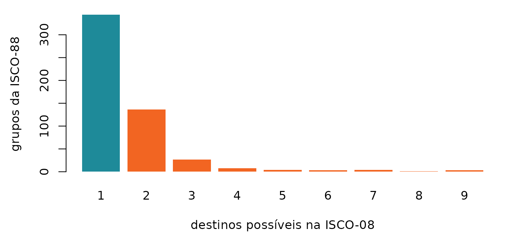
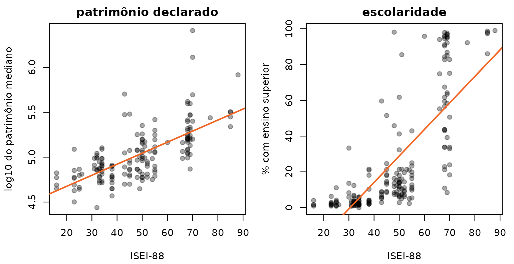
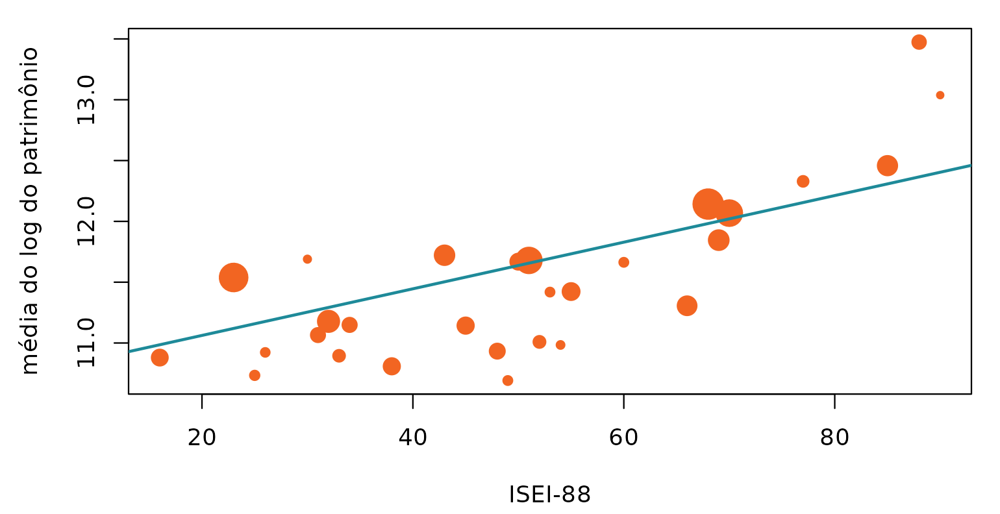
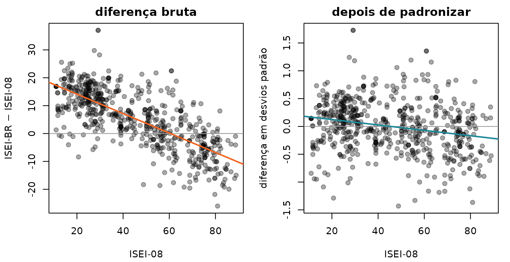
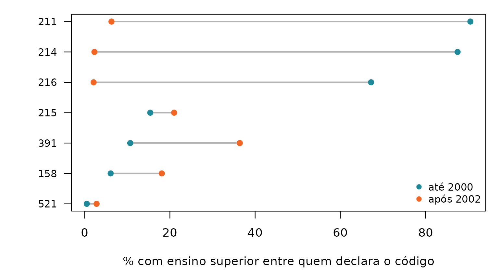
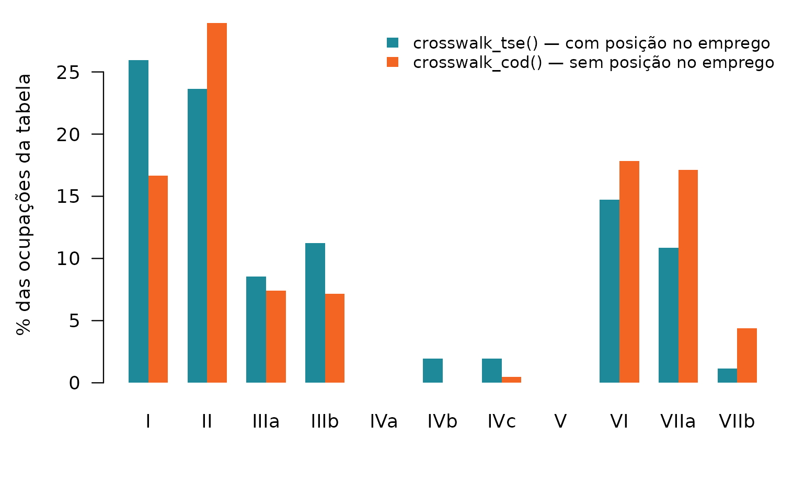

# Provas de robustez: como o pacote se põe à prova

Um pacote que traduz não tem sinal de erro. Se o dicionário puser o
médico na classe trabalhadora, nada quebra: a função devolve um vetor do
comprimento certo, o `R CMD check` passa, a análise roda e o artigo sai.
O erro só aparece na interpretação, meses depois, se aparecer.

É por isso que a suíte de testes deste pacote é grande. A maior parte
dela é rotina — tipo de retorno, comprimento, `NA` onde deve haver `NA`.
Esta página é sobre as outras: as **provas** que sustentam a afirmação
de que a tradução está certa. Cada uma responde a uma pergunta que um
parecerista tem o direito de fazer.

Todas as contas abaixo rodam ao construir esta página, sobre os dados
que vêm instalados com o pacote. Nenhum número aqui foi digitado.

## 1. A ponte entre as duas ISCO não é bijetora — e o pacote não finge que é

**O que poderia dar errado.** A ISCO-88 e a ISCO-08 não são a mesma
classificação renumerada: a de 2008 remontou famílias inteiras. Se o
pacote tratasse a ponte como um simples “de-para”, traduzir de ida e
voltar devolveria sempre o ponto de partida, e a perda de informação
ficaria invisível.

**Como se testa.** Levar toda a ISCO-88 até a ISCO-08 pela tábua do
ISMF, e trazê-la de volta pela tábua reversa — que é gerada por *outro*
script.

``` r

b <- isco88_isco08
b$volta <- isco08_isco88$isco88[match(b$isco08, isco08_isco88$isco08)]
b$onde  <- ifelse(is.na(b$volta),            "não volta",
           ifelse(b$volta == b$isco88, "volta ao mesmo", "volta a outro"))
tab <- table(b$onde)
round(100 * prop.table(tab), 1)
#> 
#>      não volta  volta a outro volta ao mesmo 
#>            0.2           30.9           68.9
```

``` r

op <- par(mar = c(4, 9, 1, 2))
x <- barplot(rev(tab), horiz = TRUE, las = 1, col = c(VERDE, LARANJA, LARANJA),
             border = NA, xlab = "grupos da ISCO-88", cex.names = 0.9)
text(rev(tab), x, rev(tab), pos = 4, cex = 0.85, xpd = NA)
```


``` r

par(op)
```

**O que significa.** Cerca de 69% volta ao ponto de partida. O terço
restante **não** é erro: é a remontagem real da classificação, e o
pacote a expõe em vez de escondê-la. A consequência prática está
documentada em
[`?isco08_para_isco88`](https://moraespeixoto.github.io/ocupacoesBR/reference/isco08_para_isco88.md):
essa porta serve para recuperar medidas que só existem na ISCO-88, e não
para converter um dado codificado em 2008 como se fosse de 1988.

**Se a prova falhasse** — isto é, se a volta desse 100% —, seria sinal
de que uma das duas tábuas foi gerada a partir da outra, e não das
sintaxes originais. Elas seriam a mesma afirmação contada duas vezes, e
a concordância entre as duas não valeria nada.

## 2. A ambiguidade da OIT foi preservada, não resolvida no escuro

**O que poderia dar errado.** Um mesmo grupo da ISCO-88 pode
corresponder a vários da ISCO-08. Escolher um “melhor” destino e seguir
em frente é o caminho cômodo — e apaga do dado a informação de que ali
houve escolha.

``` r

amb <- table(isco88_isco08$n_alternativas)
op <- par(mar = c(4.2, 4.5, 1, 1))
barplot(amb, col = ifelse(names(amb) == "1", VERDE, LARANJA), border = NA,
        xlab = "destinos possíveis na ISCO-08", ylab = "grupos da ISCO-88")
```



``` r

par(op)
```

65% dos grupos têm destino único. Os demais viajam com o número de
alternativas na coluna `n_alternativas`, e
[`crosswalk_tse()`](https://moraespeixoto.github.io/ocupacoesBR/reference/crosswalk_tse.md)
o devolve na coluna `qualidade`, que marca como **ambígua** toda
tradução em que houve mais de um caminho.

**O que significa.** Uma tabela auditável não pode apresentar um ISEI
derivado de destino único e outro derivado de uma escolha entre nove com
a mesma tipografia. O erro de medida resultante não é ruído aleatório:
ele é maior justamente no topo, que foi onde a ISCO-08 mais refinou.

## 3. Duas implementações independentes da mesma fonte

**O que poderia dar errado.** O EGP deste pacote é um porte para R de
duas sintaxes SPSS de Ganzeboom — `iskopromo.sps` e `iskoegp.sps`. Um
porte pode estar internamente coerente e errado do começo ao fim, e
nenhum teste interno pegaria isso, porque todos comparariam o porte
consigo mesmo.

**Como se testa.** Comparando com o porte que **outra pessoa** fez das
**mesmas** sintaxes: o pacote `DIGCLASS`, de Cimentada. A comparação
percorre as oito células da grade posição no emprego × subordinados, que
é onde vivem todas as regras de promoção do esquema.

``` r

tab <- DIGCLASS::all_schemas$isco88_to_egp11
chave <- sprintf("%04d", as.integer(tab[[1]]))
celulas <- list(
  list("EGP(0,0)",   FALSE,  0), list("EGP(1,0)",   TRUE,  0),
  list("EGB(0,1)",   FALSE,  1), list("EGB(1,1)",   TRUE,  1),
  list("EGP(0,2-9)", FALSE,  5), list("EGP(1,2-9)", TRUE,  5),
  list("EGP(0,10+)", FALSE, 11), list("EGP(1,10+)", TRUE, 11))

prova <- vapply(celulas, function(cel) {
  esperado <- as.integer(tab[[cel[[1]]]])
  obtido   <- isco88_para_egp(chave, rotulo = FALSE, avisar = FALSE,
                conta_propria     = rep(cel[[2]], length(chave)),
                n_supervisionados = rep(cel[[3]], length(chave)))
  ok <- !is.na(esperado) & !is.na(obtido)
  c(codigos = sum(ok), concordancia = mean(obtido[ok] == esperado[ok]))
}, numeric(2))
colnames(prova) <- vapply(celulas, `[[`, character(1), 1)
prova
```

``` r

op <- par(mar = c(6.5, 4.5, 1, 1))
barplot(100 * prova["concordancia", ], ylim = c(0, 105), border = NA,
        col = VERDE, las = 2, cex.names = 0.8,
        ylab = "concordância com o DIGCLASS (%)")
abline(h = 100, col = LARANJA, lty = 2)
par(op)
```

**O que significa.** Concordância integral em todas as oito células,
sobre NA códigos em cada uma. Duas pessoas leram a mesma sintaxe
separadamente e chegaram à mesma tabela. É a única validação do pacote
que não depende dele mesmo nem da fonte que ele próprio leu.

**A prova tem uma fragilidade, e ela está registrada.** O `DIGCLASS` não
é distribuído por repositório nenhum — instala-se do HEAD do GitHub. A
referência poderia, portanto, mudar sob o teste sem aviso. A versão e o
*commit* da conferência estão anotados em
`inst/extdata/PROVENIENCIA.yml`, na seção `conferencia_cruzada`, e o
`data-raw/00_confere_proveniencia.R` avisa quando o que está instalado
diverge do que está registrado. Sem esse registro, “bate com uma
implementação independente” seria uma frase sem data.

## 4. A medida se sustenta contra um critério externo a ela

**O que poderia dar errado.** Tudo até aqui é coerência interna. Um
crosswalk pode ser perfeitamente consistente e ordenar as ocupações de
modo que não corresponde a nada no mundo.

**Como se testa.** Contra duas variáveis que o próprio TSE coleta e que
**não entram na construção de régua nenhuma**: o patrimônio declarado e
o grau de instrução, agregados por ocupação em `tse_validacao`.

``` r

v <- tse_validacao
v$isei <- isco88_para_isei(tse_isco$isco88[match(v$cod_tse, tse_isco$cod_tse)])
v <- v[!is.na(v$isei), ]
vb <- v[!is.na(v$mediana_patrimonio), ]

op <- par(mfrow = c(1, 2), mar = c(4.2, 4.2, 2, 1), cex = 0.8)
plot(vb$isei, log10(vb$mediana_patrimonio), pch = 19, col = CINZA,
     xlab = "ISEI-88", ylab = "log10 do patrimônio mediano",
     main = "patrimônio declarado")
abline(lm(log10(mediana_patrimonio) ~ isei, vb), col = LARANJA, lwd = 2)
plot(v$isei, v$pct_superior, pch = 19, col = CINZA,
     xlab = "ISEI-88", ylab = "% com ensino superior",
     main = "escolaridade")
abline(lm(pct_superior ~ isei, v), col = LARANJA, lwd = 2)
```



``` r

par(op)

c(patrimonio   = round(cor(vb$isei, log(vb$mediana_patrimonio)), 3),
  escolaridade = round(cor(v$isei, v$pct_superior), 3))
#>   patrimonio escolaridade 
#>        0.681        0.765
```

**O que significa.** As duas nuvens sobem. A régua não foi construída
para prever nem patrimônio nem diploma, e prevê os dois. **Se esta prova
falhasse, é a medida que teria quebrado, e não o teste** — é o único
invariante do pacote com essa propriedade. A discussão completa está no
artigo [Validação contra um critério
externo](https://moraespeixoto.github.io/ocupacoesBR/articles/validacao.md).

## 5. O número do artigo se refaz sem o microdado

**O que poderia dar errado.** A correlação entre ISEI e patrimônio **no
nível do indivíduo** — não da ocupação — depende de 1,1 milhão de
candidaturas que não podem ser publicadas. Um número assim, digitado na
documentação, é inverificável por qualquer leitor, e sobrevive errado a
uma troca de fonte. Foi exatamente o que aconteceu neste pacote, duas
vezes.

**Como se testa.** Publicando as **estatísticas suficientes** em vez do
microdado. A tabela `tse_dispersao_patrimonio` traz, por faixa de ISEI,
o número de casos e as somas de log do patrimônio e do seu quadrado — e
a correlação individual se reconstrói delas por identidade algébrica.

``` r

d <- tse_dispersao_patrimonio
N   <- sum(d$n)
sx  <- sum(d$isei88 * d$n);   sy  <- sum(d$soma_log)
sxx <- sum(d$isei88^2 * d$n); syy <- sum(d$soma_log2)
sxy <- sum(d$isei88 * d$soma_log)
r_individual <- (N * sxy - sx * sy) / sqrt((N * sxx - sx^2) * (N * syy - sy^2))
c(candidaturas = N, r_individual = round(r_individual, 4))
#> candidaturas r_individual 
#> 1103019.0000       0.2074
```

``` r

op <- par(mar = c(4.2, 4.5, 1, 1))
plot(d$isei88, d$media_log, pch = 19, col = LARANJA,
     cex = 0.6 + 2.2 * sqrt(d$n / max(d$n)),
     xlab = "ISEI-88", ylab = "média do log do patrimônio")
abline(lm(media_log ~ isei88, d, weights = d$n), col = VERDE, lwd = 2)
```



``` r

par(op)
```

**O que significa.** O ponto é grande onde há muitos candidatos. Quem
instalou o pacote refaz o número do artigo com quatro linhas, sem pedir
dado a ninguém — e a próxima troca de microbase se propaga sozinha,
porque não há número digitado a atualizar.

## 6. Escalas diferentes enganam: padronizar antes de subtrair

**O que poderia dar errado.** O ISEI-BR e o ISEI-08 medem a mesma coisa
em réguas de dispersão diferente. Subtrair uma da outra e ler a
diferença como “esta ocupação subiu” produz uma lista que é, em boa
parte, a lista de quem estava embaixo — porque numa escala mais estreita
o topo cai e a base sobe por construção.

**Como se testa.** Correlacionando a diferença com o ponto de partida.
Se a diferença fosse substantiva, essa correlação seria perto de zero.

``` r

z <- function(x) (x - mean(x)) / sd(x)

# Duas unidades de análise, porque as duas importam: a célula da ISCO-08, que é
# onde a régua foi estimada, e o código do TSE, que é onde ela é usada.
celulas <- merge(isco08_isei_br[c("isco08", "isei_br")],
                 isco08_medidas[c("isco08", "isei08")])
celulas <- celulas[complete.cases(celulas), ]

cods <- data.frame(isei08  = tse_para_isei08(tse_isco$cod_tse),
                   isei_br = tse_para_isei_br(tse_isco$cod_tse))
cods <- cods[complete.cases(cods), ]

conta <- function(w) c(
  n           = nrow(w),
  sd_isei08   = sd(w$isei08),
  sd_isei_br  = sd(w$isei_br),
  bruta       = cor(w$isei_br - w$isei08, w$isei08),
  padronizada = cor(z(w$isei_br) - z(w$isei08), w$isei08))
round(rbind(`célula da ISCO-08` = conta(celulas),
            `código do TSE`     = conta(cods)), 3)
#>                     n sd_isei08 sd_isei_br  bruta padronizada
#> célula da ISCO-08 590    21.743     15.824 -0.731      -0.230
#> código do TSE     258    21.581     14.508 -0.868      -0.155
```

``` r

op <- par(mfrow = c(1, 2), mar = c(4.2, 4.2, 2, 1), cex = 0.8)
plot(celulas$isei08, celulas$isei_br - celulas$isei08, pch = 19, col = CINZA,
     xlab = "ISEI-08", ylab = "ISEI-BR − ISEI-08", main = "diferença bruta")
abline(h = 0, col = "grey60"); abline(lm(I(isei_br - isei08) ~ isei08, celulas),
                                      col = LARANJA, lwd = 2)
plot(celulas$isei08, z(celulas$isei_br) - z(celulas$isei08), pch = 19, col = CINZA,
     xlab = "ISEI-08", ylab = "diferença em desvios padrão",
     main = "depois de padronizar")
abline(h = 0, col = "grey60")
abline(lm(I(z(isei_br) - z(isei08)) ~ isei08, celulas), col = VERDE, lwd = 2)
```



``` r

par(op)
```

**O que significa.** À esquerda, a reta desce com força: a “queda” de
uma ocupação prevê-se em boa parte pelo lugar de onde ela partiu, e o
efeito é ainda maior na unidade em que a régua é de fato usada, o código
do TSE. À direita, depois de igualar média e desvio, quase não há
inclinação — o que sobra ali é a discordância de verdade entre a régua
brasileira e a importada.

**Esta prova nasceu de um erro publicado.** Até a versão 0.5.1 a
documentação trazia uma lista de “quem sobe e quem desce” lida sobre a
diferença bruta. Com as escalas igualadas, a lista muda: entram entre as
maiores altas o médico e o diretor de empresas, que a leitura bruta
escondia. O que sobrevive intacto — segurança pública sobe, clero e
artistas descem — sobrevive porque é maior do que o artefato.

## 7. O cadastro do TSE muda sob os pés

**O que poderia dar errado.** Em 2002 o TSE trocou a tabela de
ocupações. Alguns códigos foram **reaproveitados**: o mesmo número
passou a designar outra ocupação. Uma série de 1998 a 2024 agrupada só
pelo código mistura duas ocupações diferentes na mesma linha, em
silêncio.

``` r

r <- tse_quebra_2002[tse_quebra_2002$tipo == "reutilizado", ]
r[order(r$similaridade),
  c("cod_tse", "rotulo_ate_2000", "rotulo_apos_2002", "similaridade")]
#>    cod_tse                                               rotulo_ate_2000
#> 5      214                                           DELEGADO DE POLICIA
#> 6      391                                           CHEFE INTERMEDIARIO
#> 7      215        OCUPANTE DE CARGO DE DIRECAO E ASSESSORAMENTO SUPERIOR
#> 8      216               OFICIAIS DAS FORCAS ARMADAS E FORCAS AUXILIARES
#> 9      521 GOVERNANTA DE HOTEL, CAMAREIRO, PORTEIRO, COZINHEIRO E GARCOM
#> 13     158                                            DESENHISTA TÉCNICO
#> 25     211                                     PROCURADOR E ASSEMELHADOS
#>                         rotulo_apos_2002 similaridade
#> 5                      ESCULTOR E PINTOR        0.000
#> 6               TAQUÍGRAFO E ESTENÓGRAFO        0.000
#> 7        ARTISTA PLÁSTICO E ASSEMELHADOS        0.100
#> 8  EMBALADOR, EMPACOTADOR E ASSEMELHADOS        0.111
#> 9                             GOVERNANTA        0.125
#> 13                TÉCNICO EM INFORMÁTICA        0.250
#> 25  ESTIVADOR, CARREGADOR E ASSEMELHADOS        0.400
```

**Como se testa.** Contra a escolaridade das próprias candidaturas: se o
código passou a designar outra ocupação, o perfil educacional dos que o
declaram tem de saltar na virada — e saltar mais do que a tendência
geral do período, que sobe para todo mundo.

``` r

r <- r[order(r$pct_superior_ate_2000), ]
op <- par(mar = c(4.2, 5, 1, 1))
plot(range(c(r$pct_superior_ate_2000, r$pct_superior_apos_2002)),
     c(1, nrow(r)), type = "n", yaxt = "n",
     xlab = "% com ensino superior entre quem declara o código", ylab = "")
segments(r$pct_superior_ate_2000, seq_len(nrow(r)),
         r$pct_superior_apos_2002, seq_len(nrow(r)), col = "grey70", lwd = 2)
points(r$pct_superior_ate_2000,  seq_len(nrow(r)), pch = 19, col = VERDE)
points(r$pct_superior_apos_2002, seq_len(nrow(r)), pch = 19, col = LARANJA)
axis(2, seq_len(nrow(r)), r$cod_tse, las = 1, cex.axis = 0.85)
legend("bottomright", c("até 2000", "após 2002"), pch = 19, bty = "n",
       col = c(VERDE, LARANJA), cex = 0.85)
```



``` r

par(op)
```

**O que significa.** Cinco dos sete saltam muito, e no sentido que a
troca de rótulo prevê: o `214` sai de DELEGADO DE POLICIA, com quase 90%
de ensino superior, e chega a ESCULTOR E PINTOR, com quase nenhum; o
`211` faz o mesmo percurso de PROCURADOR a ESTIVADOR. É por isso que
toda função de tradução aceita `ano`: `tse_para_isei(214, ano = 1998)` e
`tse_para_isei(214, ano = 2010)` devolvem coisas diferentes, e devem.

Dois deles — o `215` e o `521` — quase não se movem nesta variável, e
vale dizer por quê em vez de esconder. A escolaridade é **uma**
evidência, não a definição: a classificação como reutilizado vem da
similaridade entre os rótulos (0,125 para o `521`, que sai de um
agregado de hotelaria e chega a GOVERNANTA), e no caso do `521` quem
separa as duas ocupações é a composição por sexo, não o diploma. Uma
prova que só olha uma variável acerta cinco de sete; é a tabela inteira
de `tse_quebra_2002` que sustenta os outros dois.

**Esta prova pegou um erro dentro do próprio pacote.** Até a 0.5.1 a
tabela `tse_validacao` era construída agrupando por código sem respeitar
a vigência — o pacote mandava passar `ano` e não passava em casa. O
`214` publicava 30,6% de ensino superior, que era o delegado
contaminando o escultor; hoje publica 2,3%.

## 8. O EGP sai degradado quando o código não carrega posição no emprego

**O que poderia dar errado.** O esquema EGP precisa de três coisas: a
ocupação, a posição no emprego (empregado ou conta própria) e o número
de subordinados. O código do TSE traz a primeira e, no dicionário do
pacote, uma marca para a segunda. A CBO e a COD trazem **só** a
ocupação. Aplicar o esquema mesmo assim devolve uma coluna que parece
completa e não é.

``` r

colapsa <- function(x) sub(":.*", "", x[!is.na(x)])
a <- table(factor(colapsa(crosswalk_tse()$egp),
                  levels = c("I","II","IIIa","IIIb","IVa","IVb","IVc",
                             "V","VI","VIIa","VIIb")))
b <- table(factor(colapsa(crosswalk_cod()$egp), levels = names(a)))

op <- par(mar = c(4.2, 4.5, 1, 1))
m <- barplot(rbind(100 * a / sum(a), 100 * b / sum(b)), beside = TRUE,
             col = c(VERDE, LARANJA), border = NA, las = 1,
             ylab = "% das ocupações da tabela")
legend("topright", c("crosswalk_tse() — com posição no emprego",
                     "crosswalk_cod() — sem posição no emprego"),
       fill = c(VERDE, LARANJA), border = NA, bty = "n", cex = 0.85)
```



``` r

par(op)
```

**O que significa.** O gráfico mostra **duas** degradações, e elas não
são iguais.

Em **IVb** e **IVc** — o conta própria sem empregados e o proprietário
rural — a barra laranja é zero ou quase, e a verde não. A diferença é
inteira da marca de posição no emprego que o dicionário do TSE carrega.
Sem ela, essas ocupações vão para onde a ocupação sozinha as manda: o
agricultor conta como trabalhador agrícola, e a pequena burguesia acaba
distribuída entre a classe de serviço e a classe trabalhadora. Isso é
inversão de classe, não arredondamento.

Em **IVa** e **V** as duas barras são zero. Aí nem o TSE resolve:
separar IVa de IVb exige o **número de subordinados**, que nenhuma das
quatro portas do pacote tem. Todos os empregadores caem em IVb, e V — os
técnicos de nível inferior e supervisores manuais — fica subestimada. É
por isso que
[`?crosswalk_tse`](https://moraespeixoto.github.io/ocupacoesBR/reference/crosswalk_tse.md)
manda preferir os colapsos de 7 ou 5 classes para publicar: são os que
não dependem dessa distinção.

O pacote não pode consertar isso — a informação não está no código —,
mas pode dizê-lo: a advertência está em
[`?crosswalk_cod`](https://moraespeixoto.github.io/ocupacoesBR/reference/crosswalk_cod.md),
[`?crosswalk_cbo2002`](https://moraespeixoto.github.io/ocupacoesBR/reference/crosswalk_cbo2002.md)
e
[`?crosswalk_cbo94`](https://moraespeixoto.github.io/ocupacoesBR/reference/crosswalk_cbo94.md),
e a saída para quem precisa de uma estimativa é o `isco_posicao_br`, que
traz a proporção observada de conta própria e de empregadores por grupo
da ISCO-88 na PNAD Contínua.

## 9. A fonte não pode mudar em silêncio

**O que poderia dar errado.** Nenhuma tabela deste pacote é digitada:
todas são geradas por script a partir das sintaxes do ISMF e da tábua do
Ministério do Trabalho. Isso é uma virtude e um risco. Se uma fonte for
reeditada, ou se alguém corrigir um `.sps` à mão, os dados do pacote
mudam na próxima geração — e um resultado já publicado deixa de replicar
sem que nada avise.

**Como se testa.** As fontes viajam **dentro** do pacote, e o `sha256`
de cada uma está registrado.

``` r

yml <- system.file("extdata", "PROVENIENCIA.yml", package = "ocupacoesBR")
linhas <- readLines(yml, warn = FALSE, encoding = "UTF-8")
arquivos <- trimws(sub("^\\s*-?\\s*arquivo:\\s*", "",
                       grep("^\\s*-?\\s*arquivo:", linhas, value = TRUE)))
length(arquivos)
#> [1] 20

base <- system.file("extdata", "fontes", package = "ocupacoesBR")
head(basename(list.files(base, recursive = TRUE)), 4)
#> [1] "cbo2002_dominio.txt"        "Estrutura_Ocupacao_COD.xls"
#> [3] "familias.txt"               "isco0888.sps"
```

**O que significa.** Um teste da suíte recalcula os 20 hashes e falha se
qualquer um divergir. A mensagem de erro é explícita quanto ao que
fazer: se a mudança foi deliberada, atualize o registro **e regere os
dados** — nunca só o hash. É a diferença entre um pacote que gera os
seus dados e um pacote que os tem.

------------------------------------------------------------------------

## Por que estas nove, e não outras

Cada uma responde a um modo distinto de o pacote estar errado sem
parecer:

| A prova | O modo de falha que ela fecha |
|----|----|
| 1\. Ida e volta | duas tábuas que são a mesma afirmação contada duas vezes |
| 2\. Ambiguidade | escolha silenciosa apresentada como tradução exata |
| 3\. `DIGCLASS` | porte internamente coerente e errado do começo ao fim |
| 4\. Critério externo | medida consistente que não corresponde a nada |
| 5\. Estatísticas suficientes | número inverificável, que sobrevive errado |
| 6\. Padronização | artefato de escala lido como resultado substantivo |
| 7\. Vigência | duas ocupações somadas na mesma série |
| 8\. EGP degradado | coluna que parece completa e está estruturalmente vazia |
| 9\. `sha256` | fonte que muda por baixo de um resultado publicado |

Três delas — a 6, a 7 e a 5 — existem porque o erro correspondente **foi
cometido e publicado** neste pacote, e está descrito nas
[Novidades](https://moraespeixoto.github.io/ocupacoesBR/news/index.md).
Uma prova de robustez que ninguém nunca viu falhar costuma ser uma prova
que não testa nada.
