# Comece aqui: da ocupação declarada à posição social

Toda candidatura registrada no Tribunal Superior Eleitoral declara uma
ocupação. Ela chega como um número entre 100 e 999, sem escala, sem
ordem e sem sentido fora do próprio cadastro. Este pacote existe para
transformar esse número em alguma coisa que se possa somar, comparar
entre eleições e confrontar com a literatura internacional.

## Uma linha, e o banco ganha uma coluna

Na prática o pacote se usa assim: você passa a coluna inteira de códigos
e recebe a coluna traduzida, alinhada linha a linha.

``` r
library(dplyr)

dados <- dados |> mutate(isei = tse_para_isei(CD_OCUPACAO, ano = ANO_ELEICAO))
#> Warning: There was 1 warning in `mutate()`.
#> ℹ In argument: `isei = tse_para_isei(CD_OCUPACAO, ano = ANO_ELEICAO)`.
#> Caused by warning:
#> ! 1 candidatura(s) usam código(s) que o TSE REUTILIZOU depois (214): naquele ano designavam outra ocupação, e voltam NA.
#> Veja ?tse_vigencia.

dados
#>   ANO_ELEICAO CD_OCUPACAO          DS_CARGO isei
#> 1        2026         131  DEPUTADO FEDERAL   85
#> 2        2026         601 DEPUTADO ESTADUAL   23
#> 3        2026         298           SENADOR   NA
#> 4        2026         999 DEPUTADO ESTADUAL   NA
#> 5        1998         214  DEPUTADO FEDERAL   NA
```

Em R base, a mesma coisa:

``` r
dados$isei <- tse_para_isei(dados$CD_OCUPACAO, ano = dados$ANO_ELEICAO)
```

Não há loop nem tradução código a código, e o banco não muda de tamanho:
entram `n` códigos, saem `n` escores. Vale para qualquer uma das funções
— troque `tse_para_isei` por `tse_para_prestigio`, `tse_para_egp`,
`tse_para_classe` ou `tse_para_estrato` e o comportamento é o mesmo.

**Passe o `ano` sempre nomeado**, como nos exemplos acima. Ele é o
segundo argumento de
[`tse_para_isei()`](https://moraespeixoto.github.io/ocupacoesBR/reference/tse_para_isei.md),
mas não de todas: em
[`tse_para_classe()`](https://moraespeixoto.github.io/ocupacoesBR/reference/tse_para_classe.md)
o segundo é `superior`, e em
[`tse_para_egp()`](https://moraespeixoto.github.io/ocupacoesBR/reference/tse_para_egp.md)
é `conta_propria`. Escrever `tse_para_classe(cod, ano_vec)` por analogia
entrega o ano onde se espera uma marca binária — o pacote agora recusa
isso com erro, mas até 09/2026 ele o lia como “sim” em toda linha e
devolvia a coluna errada em silêncio.

O `ano` também é uma coluna, e é ele que resolve a quebra de cadastro de
2002. A última linha do exemplo mostra por quê: em 1998 o código 214 era
delegado de polícia, e hoje é escultor e pintor. Com `ano`, o pacote
devolve `NA` e avisa; sem ele, aquela linha receberia calada o escore de
escultor.

O cadastro foi reeditado em 2002, mas o 214 só reaparece com o rótulo
novo em 2006 — e é essa segunda data que o corte usa. Os detalhes estão
em [Os
percursos](https://moraespeixoto.github.io/ocupacoesBR/articles/percursos.md).

O resto deste artigo é sobre o que essa coluna nova significa.

## O percurso

O percurso tem sempre a mesma forma: o código do TSE vira um código da
Classificação Internacional Uniforme de Ocupações, e é dela que saem as
medidas.


O percurso do código do TSE até as medidas

## A tabela que resume o pacote

Oito das ocupações mais declaradas nas candidaturas brasileiras,
passando por todas as portas de uma vez:

``` r
cods <- c("601", "131", "257", "278", "169", "298", "581", "923")

data.frame(
  cod     = cods,
  rotulo  = tse_para_rotulo(cods),
  isco    = tse_para_isco(cods),
  isei    = tse_para_isei(cods),
  presti  = tse_para_prestigio(cods),
  egp     = as.character(tse_para_egp(cods)),
  classe  = as.character(tse_para_classe(cods, ano = rep(2026L, length(cods))))
)
#> Warning: EGP calculado sem `n_supervisionados`. A divisão entre IVa (com
#> empregados) e IVb (sem) fica indeterminada — todos caem em IVb — e V fica
#> subestimada; para publicar prefira n_classes = 7 ou 5; veja ?isco88_para_egp.
#>   cod                               rotulo isco isei presti
#> 1 601                           AGRICULTOR 6100   23     38
#> 2 131                             ADVOGADO 2421   85     73
#> 3 257                           EMPRESARIO 1200   68     60
#> 4 278                             VEREADOR 1100   70     67
#> 5 169                          COMERCIANTE 1300   51     50
#> 6 298           SERVIDOR PÚBLICO MUNICIPAL <NA>   NA     NA
#> 7 581                         DONA DE CASA <NA>   NA     NA
#> 8 923 APOSENTADO (EXCETO SERVIDOR PUBLICO) <NA>   NA     NA
#>                                        egp                           classe
#> 1                  IVc: proprietário rural             Trabalhadores rurais
#> 2 I: dirigentes e profissionais superiores  Profissionais de nível superior
#> 3 I: dirigentes e profissionais superiores     Proprietários e empregadores
#> 4 I: dirigentes e profissionais superiores           Dirigentes e políticos
#> 5        IVb: conta própria sem empregados     Proprietários e empregadores
#> 6                                     <NA> Vínculo público não especificado
#> 7                                     <NA>          Fora da PEA por posição
#> 8                                     <NA>           Inativo com trajetória
```

O aviso que apareceu junto não é ruído. O EGP não se define pela
ocupação sozinha: ele precisa da **posição no emprego** — quem é
empregador, quem trabalha por conta própria, quem é empregado — e do
**número de subordinados**. O dicionário do TSE traz a primeira; a
segunda o cadastro não registra. O pacote calcula assim mesmo, mas diz o
que ficou indeterminado. Nenhuma função deste pacote devolve um número
em silêncio quando sabe que ele está incompleto.

Vale demorar nesta tabela, porque ela contém quase tudo o que é preciso
saber antes de usar o pacote.

As cinco primeiras linhas se comportam como se espera: agricultor,
advogado, empresário, vereador e comerciante recebem um ISCO, um ISEI,
um prestígio, uma classe do EGP e uma classe do esquema eleitoral. As
três últimas não. Servidor público municipal, dona de casa e aposentado
saem com `NA` no ISEI, no prestígio e no EGP, e mesmo assim recebem uma
classe.

Isso não é falha de cobertura. É o desenho da medida. “Servidor público
municipal” não nomeia ocupação alguma: nomeia um vínculo. Dentro dele há
o médico da rede e o gari, e não existe escore honesto que sirva para os
dois. O ISEI se cala porque não sabe, e o esquema de classes responde
outra coisa — que a pessoa tem vínculo público não especificado, o que é
uma informação verdadeira e útil.

A regra que decorre disso: **o `NA` do ISEI é informação, não buraco**.
Quem o substitui por zero, pela média, ou quem elimina essas linhas da
análise, está descartando justamente as candidaturas mais numerosas.

``` r
r <- tse_ocupacao_rotulos
sem_isei <- suppressWarnings(is.na(tse_para_isei(r$cod_tse)))
round(100 * sum(r$n[sem_isei]) / sum(r$n), 1)
#> [1] 35.8
```

35.8% de todas as candidaturas de 1998 a 2026 estão em códigos sem ISEI.
Jogá-las fora não é um detalhe metodológico.

## As quatro portas de entrada

O TSE é a porta principal, mas não é a única. O pacote também traduz a
Classificação Brasileira de Ocupações, que é o que a RAIS, o CAGED e o
eSocial usam, e a classificação de ocupações do IBGE, que é o que está
na PNAD Contínua desde 2012 e nos Censos de 2010 e 2022.

Uma fonte comum fica **fora**: o Censo de 2000 e a PNAD anual, de 2002 a
2015, usam a CBO-Domiciliar, que não é nem a CBO-2002 nem a COD. O
pacote não tem porta para ela, e entrar com esse dado pela CBO-2002
traduz códigos que não são os mesmos.



As quatro portas e onde cada uma chega

### Pelo TSE

``` r
tse_para_isei(c("131", "601", "999"))
#> [1] 85 23 NA
```

O `999` é a categoria residual “OUTROS”, e é a mais declarada de todas.
Ela sai como `NA` por construção.

### Pela CBO-2002

``` r
cbo2002_para_isco(c("252105", "782305"))
#> [1] "2419" "8322"
cbo2002_para_isei(c("252105", "782305"))
#> [1] 69 30
```

### Pela CBO-94

``` r
cbo94_para_isei(c("09220", "98140"))
#> [1] 69 32
```

A CBO-94 chega à ISCO-88 e para aí no que toca a **medidas**: não
existem `cbo94_para_isei08()`, `cbo94_para_prestigio08()` nem
`cbo94_para_isei_br()`. A tradução de código existe, e
[`cbo94_para_isco08()`](https://moraespeixoto.github.io/ocupacoesBR/reference/cbo94_para_isco08.md)
a faz.

O que falta é o atalho, não o caminho — e vale ser exato sobre isso,
porque a diferença é de interface, não de possibilidade:

``` r
isco08_para_isei_br(cbo94_para_isco08("2-11.20"))
#> [1] 72
```

O pacote não oferece a porta direta porque a CBO-94 é microdado anterior
a 2003, e não quer que se chegue a um escore de 2008 ou de 2025 sem ter
escrito as duas etapas. Quem as escrever fez a escolha conscientemente,
que é tudo o que a recusa pretende garantir.

Convém dizer o que essa razão **não** é. Ela não é adequação temporal em
geral: o ISEI-88 foi estimado sobre dados de 1968 a 1982 e o pacote o
aplica a candidaturas de 2026 sem objeção. A âncora ISCO-88 é a escolha
do pacote por consistência interna da série eleitoral, não por ser
contemporânea do dado. O critério corta num sentido só, e é honesto
dizer isso em vez de deixar o leitor concluir que há uma regra geral de
data que o pacote segue.

### Pelo IBGE

``` r
cod_para_isco08(c("2211", "6111"))
#> [1] "2211" "6111"
cod_para_isei08(c("2211", "6111"))
#> [1] 88.70 11.56

# a régua estimada em dado brasileiro, pela mesma porta
cod_para_isei_br(c("2211", "6111"))
#> [1] 84.6 26.2
```

A última é o ISEI-BR, estimado sobre a PNAD Contínua em vez de
importado. Ela não substitui as outras duas e responde a outra pergunta.
Leia
[`?isco08_isei_br`](https://moraespeixoto.github.io/ocupacoesBR/reference/isco08_isei_br.md)
antes de escolher entre elas.

## O último passo, que não é opcional

Antes de qualquer análise, verifique quanto do seu vetor a régua
alcança:

``` r
cods_2026 <- unique(tse_ocupacao_rotulos$cod_tse[tse_ocupacao_rotulos$ate == 2026])
checa_cobertura(cods_2026)
#> cobertura ok: 210 códigos observados, todos no dicionário.
```

A função devolve `TRUE` invisivelmente e imprime o diagnóstico; quando
não há código válido nenhum, ela **falha com erro** em vez de devolver
`FALSE`. É deliberado: cobertura zero quase nunca é um achado sobre a
população, e quase sempre é a coluna errada ou o formato errado — zeros
à esquerda perdidos numa leitura de CSV, ou um fator convertido para
inteiro. Um `FALSE` seguiria adiante no pipeline; o erro para.

## Onde continuar

Os percursos, com o que acontece quando a tradução é ambígua, estão em
[Os
percursos](https://moraespeixoto.github.io/ocupacoesBR/articles/percursos.md).
A escolha entre ISEI, prestígio, EGP e o esquema de classes está na
vinheta [Qual régua responde à sua
pergunta](https://moraespeixoto.github.io/ocupacoesBR/articles/qual-regua.md),
e é a leitura mais importante antes de publicar qualquer coisa feita com
este pacote.
