# Os percursos, e onde cada um se interrompe

Uma tradução que sempre devolve uma resposta é uma tradução que mente em
algum lugar. Este artigo percorre os quatro caminhos do pacote e mostra,
em cada um, onde ele para e por quê.

## A ponte entre as duas ISCO

A Organização Internacional do Trabalho revisou a ISCO-88 em 2008, e a
revisão não é uma renumeração: ocupações foram fundidas, separadas e
movidas de grande grupo. A tábua do *International Stratification and
Mobility File* registra essas mudanças, e em boa parte dos casos um
código antigo tem mais de um destino possível.



A ambiguidade da ponte ISCO-88 para ISCO-08

``` r
table(isco88_isco08$n_alternativas > 1)
#> 
#> FALSE  TRUE 
#>   344   186
```

São 186 códigos ambíguos em 530. A escolha entre os destinos não é do
pacote: a sintaxe do ISMF guarda as alternativas na parte decimal do
código e manda truncá-la quando não há informação adicional. O pacote
trunca, como manda, e guarda a contagem. Isso importa para ler o erro
que resulta: como o destino escolhido é sempre o mesmo para um dado
código de origem, o desvio é **sistemático**, não aleatório — ele não se
cancela ao agregar.

A função devolve, por padrão, apenas o destino escolhido:

``` r
isco88_para_isco08("1229")
#> [1] "1300"
```

E devolve a marca junto quando ela é pedida:

``` r
isco88_para_isco08("1229", com_ambiguidade = TRUE)
#>   isco88 isco08 n_alternativas
#> 1   1229   1300              9
```

O `com_ambiguidade` não muda a tradução. Ele diz quanta confiança ela
merece, e existe para que a incerteza possa entrar na análise em vez de
desaparecer nela.

## A escada da CBO, e o empate

O dado administrativo brasileiro é sujo de um jeito específico: o código
de seis dígitos da CBO-2002 aparece truncado em quatro, ou aparece com
um sufixo que a tábua oficial não conhece. O pacote tem duas respostas
para isso, e elas fazem coisas diferentes.


O que a CBO-2002 faz quando o código não está na tábua

O `empate` decide o que fazer quando a entrada é uma família de quatro
dígitos e as ocupações dessa família não concordam num único ISCO:

``` r
empatadas <- cbo2002_familia_isco88$familia[cbo2002_familia_isco88$empate]
length(empatadas)
#> [1] 19

suppressWarnings(cbo2002_para_isco(empatadas[1:3]))
#> [1] NA NA NA
cbo2002_para_isco(empatadas[1:3], empate = "moda")
#> [1] "2111" "2451" "3111"
```

O padrão é `"na"`, e é o padrão certo: numa família empatada a tábua não
sabe, e `"moda"` é uma escolha do analista, que deve ser declarada.

A `escada` é outra coisa. Ela só age sobre o que já saiu `NA`, e sobe a
hierarquia da classificação até achar um prefixo que a tábua conheça:

``` r
# códigos no formato da RAIS que não estão na tábua ocupação a ocupação
fora <- paste0(substr(cbo2002_isco88$cbo2002[1:40], 1, 4), "99")

sum(!is.na(suppressWarnings(cbo2002_para_isco(fora))))
#> [1] 0
sum(!is.na(cbo2002_para_isco(fora, escada = TRUE)))
#> Warning: 16 código(s) sem correspondência em cbo2002_isco88: 111199, 111399,
#> 131399, 141499, 141599, 141699, 141799, 142199, 142299, 142399, ...
#> [1] 33
```

Quarenta entradas — 16 códigos distintos — que a tradução direta não
resolve, e a escada resolve trinta e três. O que resta `NA` é um código
só, repetido:

``` r
unique(fora[is.na(cbo2002_para_isco(fora, escada = TRUE))])
#> Warning: 16 código(s) sem correspondência em cbo2002_isco88: 111199, 111399,
#> 131399, 141499, 141599, 141699, 141799, 142199, 142299, 142399, ...
#> [1] "142399"
```

E a razão não é que o prefixo falte na tábua. A família `1423` **está**
lá:

``` r
suppressWarnings(cbo2002_para_isco("1423"))
#> [1] "2419"
```

A escada exige que as ocupações compartilhem um ancestral **na ISCO**, e
as da família 1423 se espalham por 1233, 1234, 1239 e 2419 — não há
prefixo comum acima do primeiro dígito. A consulta por família não exige
isso: ela devolve a moda. São duas regras diferentes para a mesma
família, e a escada é a mais conservadora das duas.

``` r
fam <- cbo2002_familia_isco88$familia
por_familia <- suppressWarnings(cbo2002_para_isco(fam))
por_escada  <- suppressWarnings(cbo2002_para_isco(paste0(fam, "99"), escada = TRUE))
fam[!is.na(por_familia) & is.na(por_escada)]
#> [1] "1423" "2531" "3123" "3227" "5101" "5199" "7612" "8421"
```

Nessas famílias, entrar com quatro dígitos devolve um ISCO e entrar com
seis e `escada = TRUE` devolve `NA`. Não é defeito: é a escada recusando
o que a moda aceita. Mas quem alterna entre as duas entradas precisa
saber que elas não respondem a mesma coisa.

O preço dos trinta e três é a perda de resolução, e ele fica registrado:
[`crosswalk_cbo2002()`](https://moraespeixoto.github.io/ocupacoesBR/reference/crosswalk_cbo2002.md)
devolve a coluna `nivel_usado`, que diz em que degrau cada tradução foi
obtida.

``` r
cw <- crosswalk_cbo2002(fora, escada = TRUE)
table(cw$nivel_usado, useNA = "ifany")
#> 
#>    4 <NA> 
#>   33    7
```

## A tradução que não tem tábua

Os três percursos acima partem de classificações que alguém publicou: a
OIT publica a ponte, o Ministério do Trabalho publica a tábua da CBO, o
IBGE publica a da COD. A tradução do cadastro do TSE para a ISCO-88 não
tem documento externo nenhum. Ela é **autoral** — é a única do pacote —
e por isso é a que mais merece ser auditada por quem usa.

O que ela custa não é opinião, é medida. Os códigos do TSE com ISCO caem
num número de destinos muito menor que o seu próprio:

``` r
cw <- tse_isco[!is.na(tse_isco$isco88), ]
c(codigos_tse = nrow(cw),
  isco88_distintos = length(unique(cw$isco88)),
  valores_de_isei = length(unique(isco88_para_isei(cw$isco88))))
#>      codigos_tse isco88_distintos  valores_de_isei 
#>              258               42               29
```

Duzentos e cinquenta e oito códigos chegam a vinte e nove valores
distintos de ISEI. A compressão não é uniforme: ela depende de em
quantos dígitos a tradução foi possível.

``` r
table(cw$estrato, cw$nivel)
#>                    
#>                      2  3  4
#>   Classe alta       64 12 12
#>   Classe média      57  8  4
#>   Classes populares 96  5  0
```

É aqui que está o ponto que nenhuma outra página do site diz. O
refinamento a quatro dígitos é **seletivo por estrato**: doze dos
oitenta e oito códigos da classe alta chegam lá, e **nenhum** dos cento
e um das classes populares. O erro de medida que a tradução introduz não
é ruído — é heterocedástico e correlacionado com a posição social que se
quer medir.

A consequência prática é estreita e vale dizer inteira: comparações
**dentro** das classes populares apoiam-se em escores mais agregados do
que comparações dentro da classe alta, e uma diferença pequena no fundo
da distribuição é menos confiável que a mesma diferença no topo. Não é
razão para não usar a medida; é razão para não ler diferenças finas onde
a tradução foi grossa.

## A quebra de 2002 no cadastro do TSE

O TSE reformou o cadastro de ocupações entre a eleição de 2000 e a de
2002, e a reforma reaproveitou números. O código 214 era delegado de
polícia até 2000 e hoje é escultor e pintor.

Convém separar duas datas que é fácil confundir. A **reedição do
cadastro** é de 2002: é o fato documental. Mas o ano em que cada código
reaparece com o rótulo novo é outro, e é o que o dado mostra:

``` r
tse_quebra_2002[tse_quebra_2002$tipo == "reutilizado",
                c("cod_tse", "rotulo_ate_2000", "rotulo_apos_2002",
                  "primeiro_ano_novo")]
#>    cod_tse                                               rotulo_ate_2000
#> 5      214                                           DELEGADO DE POLICIA
#> 6      391                                           CHEFE INTERMEDIARIO
#> 7      215        OCUPANTE DE CARGO DE DIRECAO E ASSESSORAMENTO SUPERIOR
#> 8      216               OFICIAIS DAS FORCAS ARMADAS E FORCAS AUXILIARES
#> 9      521 GOVERNANTA DE HOTEL, CAMAREIRO, PORTEIRO, COZINHEIRO E GARCOM
#> 13     158                                            DESENHISTA TÉCNICO
#> 25     211                                     PROCURADOR E ASSEMELHADOS
#>                         rotulo_apos_2002 primeiro_ano_novo
#> 5                      ESCULTOR E PINTOR              2006
#> 6               TAQUÍGRAFO E ESTENÓGRAFO              2006
#> 7        ARTISTA PLÁSTICO E ASSEMELHADOS              2006
#> 8  EMBALADOR, EMPACOTADOR E ASSEMELHADOS              2008
#> 9                             GOVERNANTA              2004
#> 13                TÉCNICO EM INFORMÁTICA              2006
#> 25  ESTIVADOR, CARREGADOR E ASSEMELHADOS              2006
```

Nenhum deles reaparece em 2002: são 2004, 2006 e 2008. O 214 só volta,
como escultor, em 2006 — há um intervalo em que o código simplesmente
não é declarado.

``` r
tse_vigencia(214)
#>   cod_tse   de  ate              rotulo   n
#> 1     214 1998 2000 DELEGADO DE POLICIA 352
#> 2     214 2006 2026   ESCULTOR E PINTOR 706
```

É `primeiro_ano_novo`, e não 2002, que o corte usa: o pacote anula o
escore onde `ano < primeiro_ano_novo`. Uma candidatura de 2004 com o
código 214 volta `NA`, e é o comportamento certo — em 2004 aquele número
não nomeava nem uma coisa nem outra.

Por isso todas as funções da porta do TSE aceitam `ano`:

``` r
tse_para_isei("214")
#> [1] 54
tse_para_isei(c("214", "214"), ano = c(1998L, 2026L))
#> Warning: 1 candidatura(s) usam código(s) que o TSE REUTILIZOU depois (214): naquele ano designavam outra ocupação, e voltam NA.
#> Veja ?tse_vigencia.
#> [1] NA 54
```

Sem o `ano`, o pacote aplica o cadastro atual a tudo, e uma série de
1998 a 2026 que passe por qualquer um desses códigos descreve uma
trajetória que nunca existiu. O
[`checa_periodo()`](https://moraespeixoto.github.io/ocupacoesBR/reference/checa_periodo.md)
avisa quando o vetor de códigos toca a quebra.

## A categoria residual

Nenhum dos percursos acima resolve o problema maior, que é anterior a
todos eles: a ocupação mais declarada nas candidaturas brasileiras é
“OUTROS”.

``` r
r <- tse_ocupacao_rotulos
round(100 * sum(r$n[r$cod_tse == "999"]) / sum(r$n), 1)
#> [1] 16.8
```

16.8% de todas as candidaturas de 1998 a 2026. O pacote devolve `NA`
para ela, e nenhuma escada, nenhum desempate e nenhuma ponte muda isso.
É o limite do dado, e ele é declarado em vez de preenchido.
