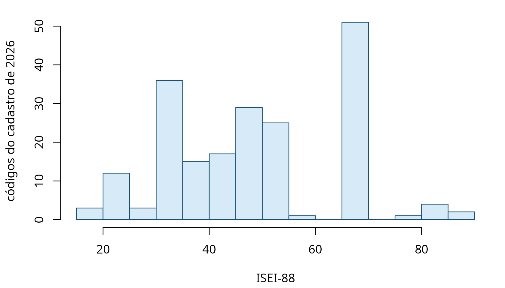

# A safra de 2026, na régua

A versão 0.3.0 incorporou o cadastro de ocupações da eleição de 2026.
Nada nesta página lê microdado: tudo sai das tabelas que acompanham o
pacote.

``` r
r <- tse_ocupacao_rotulos
cods_2026 <- unique(r$cod_tse[r$ate == 2026])
length(cods_2026)
#> [1] 210
```

São 210 códigos vigentes.

## O TSE não criou código nenhum

O resultado que mais importa para quem já usava o pacote é negativo:

``` r
d <- tse_diff_cadastro(2024, 2026)
table(d$mudanca)
#> 
#> extinto 
#>      46
```

Nenhum código criado. O dicionário de tradução, que é a única ponte
autoral do pacote, não precisou de uma linha nova para cobrir a eleição
em curso, e a cobertura é total:

``` r
checa_cobertura(cods_2026)
#> cobertura ok: 210 códigos observados, todos no dicionário.
```

Os 46 códigos que aparecem como extintos merecem cuidado, porque o nome
engana. Eles não foram revogados: 2024 foi uma eleição municipal e 2026
é geral, e há ocupações que simplesmente não foram declaradas por
ninguém desta vez. Ausência de declaração não é revogação de código.
Trocar de par de comparação não resolve — comparar duas eleições gerais
devolve 48 extintos, e não menos.

## O que a régua alcança

``` r
isei_2026 <- suppressWarnings(tse_para_isei(cods_2026))
sum(!is.na(isei_2026))
#> [1] 198
summary(isei_2026)
#>    Min. 1st Qu.  Median    Mean 3rd Qu.    Max.     NAs 
#>    16.0    34.0    50.0    49.6    68.0    90.0      12
```

198 dos 210 códigos recebem um ISEI. Os doze restantes são os que não
nomeiam ocupação: a categoria residual, os vínculos públicos sem função,
quem está fora da população economicamente ativa.



A distribuição é ampla e bimodal, e isso é uma propriedade do cadastro,
não do eleitorado: cada código conta uma vez, independentemente de
quantas pessoas o declararam. O cadastro do TSE detalha muito o topo,
com dezenas de profissões de nível superior nomeadas uma a uma, e agrega
grosseiramente a base.

## Onde o esquema de classes responde e o ISEI não

``` r
cl <- tse_para_classe(cods_2026, ano = rep(2026L, length(cods_2026)))
sort(table(as.character(cl)), decreasing = TRUE)
#> 
#>       Profissionais de nível superior Classe média técnica e administrativa 
#>                                    54                                    53 
#>     Operários e trabalhadores manuais  Trabalhadores de serviços e comércio 
#>                                    39                                    30 
#>                Dirigentes e políticos         Militares e segurança pública 
#>                                     9                                     5 
#>          Proprietários e empregadores                Inativo com trajetória 
#>                                     5                                     4 
#>                  Trabalhadores rurais      Vínculo público não especificado 
#>                                     4                                     4 
#>               Fora da PEA por posição                         Não informado 
#>                                     2                                     1
```

As quatro categorias que o ISEI deixa em branco reaparecem aqui
nomeadas: quem tem vínculo público não especificado, quem está fora da
população economicamente ativa por posição, quem é inativo com
trajetória, e o não informado. É a mesma lição da tabela em [Comece
aqui](https://moraespeixoto.github.io/ocupacoesBR/articles/comece-aqui.md),
agora sobre o cadastro inteiro.

## O que não se pode medir ainda

A safra de 2026 é aberta. O prazo de registro se encerrou, mas os
pedidos ainda estão sendo julgados, e não há resultado. Três
consequências práticas:

O patrimônio declarado não entra. A coluna de patrimônio de
`tse_validacao` está deflacionada a reais de outubro de 2024, e outubro
de 2026 não aconteceu. Em vez de inventar um deflator, o pacote se
abstém:

``` r
sum(tse_validacao$n)
#> [1] 3359194
sum(tse_validacao$n_com_bens)
#> [1] 1592274
```

O acréscimo de 2026 aparece no `n` e não aparece no `n_com_bens`.
Nenhuma mediana de patrimônio do conjunto de validação foi tocada pela
safra nova.

Não há eleitos. Toda análise de sucesso eleitoral por ocupação continua
parando em 2024.

E não há painel por pessoa. O carregamento retrospectivo de
[`isei_retrospectivo()`](https://moraespeixoto.github.io/ocupacoesBR/reference/isei_retrospectivo.md)
depende de reencontrar a mesma pessoa em registros anteriores, o que
exige a apuração fechada. Os números de recuperação documentados na
função seguem medidos sobre 1998–2024.

## Como declarar o recorte

Quem publicar análise da eleição em curso deve dizer a data de geração
do cadastro usado, porque ele muda enquanto o registro é julgado. O que
o pacote fixa é o dicionário de tradução, que não mudou; o que se move é
o dado de candidaturas, que fica com quem o baixou.
