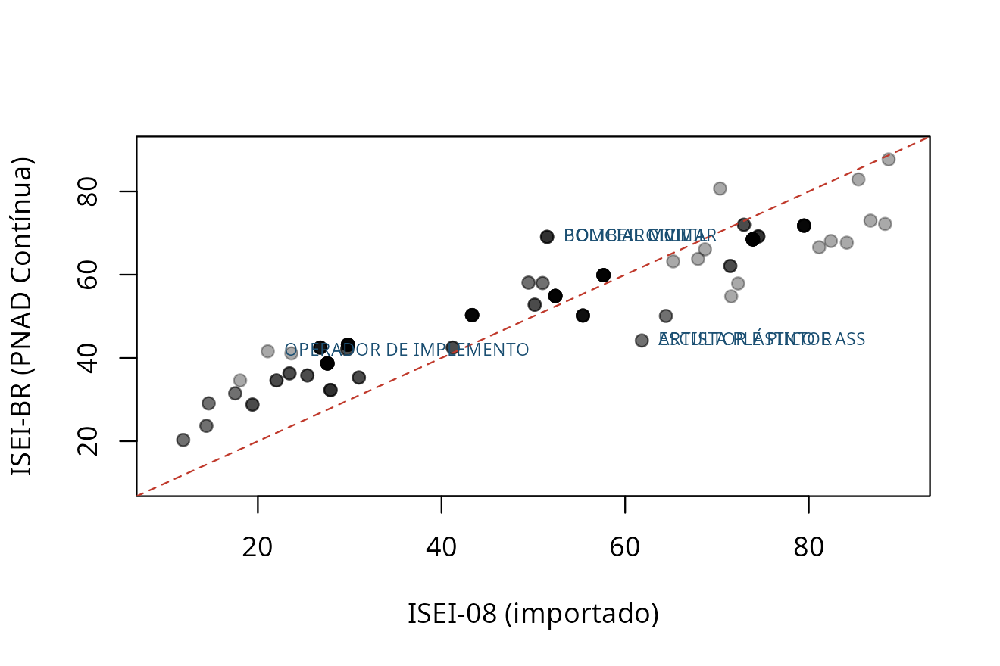

# A medida se sustenta? Validação contra um critério externo

Todo o resto deste pacote é tradução: um código do TSE vira um ISCO, que
vira um ISEI. Nada nessa cadeia se afere contra coisa alguma **fora**
dela — e um crosswalk internamente consistente pode estar inteiramente
errado.

Esta vinheta faz a única pergunta que importa: as posições que a medida
atribui correspondem a algo observável e independente?

O critério são duas variáveis que o próprio TSE coleta e que **não
entram na construção da medida em momento nenhum**: o patrimônio
declarado na candidatura e o grau de instrução. Elas estão agregadas por
ocupação em `tse_validacao`.

``` r
library(ocupacoesBR)

v <- tse_validacao
v$isei   <- isco88_para_isei(tse_isco$isco88[match(v$cod_tse, tse_isco$cod_tse)])
v$rotulo <- tse_para_rotulo(v$cod_tse)
v <- v[!is.na(v$isei), ]

# A mediana de patrimonio e NA onde faltam declaracoes de bens suficientes (ver
# ?tse_validacao). A escolaridade esta medida em todas as linhas; o patrimonio,
# so nestas.
vb <- v[!is.na(v$mediana_patrimonio), ]
c(com_escolaridade = nrow(v), com_patrimonio = nrow(vb))
#> com_escolaridade   com_patrimonio 
#>              208              165
```

## O resultado

``` r
r <- function(x, y, m = "pearson") round(cor(x, y, method = m), 3)

# A correlação no nível do INDIVÍDUO sai dos somatórios publicados em
# `tse_dispersao_patrimonio`, sem microdado: veja `?tse_dispersao_patrimonio`.
d <- tse_dispersao_patrimonio
N <- sum(d$n); sx <- sum(d$isei88 * d$n); sy <- sum(d$soma_log)
sxx <- sum(d$isei88^2 * d$n); syy <- sum(d$soma_log2)
sxy <- sum(d$isei88 * d$soma_log)
r_individual <- (N * sxy - sx * sy) / sqrt((N * sxx - sx^2) * (N * syy - sy^2))

data.frame(
  criterio = c("% com ensino superior", "log da mediana de patrimonio"),
  n        = c(nrow(v), nrow(vb)),
  pearson  = c(r(v$isei, v$pct_superior),
               r(vb$isei, log(vb$mediana_patrimonio))),
  spearman = c(r(v$isei, v$pct_superior, "spearman"),
               r(vb$isei, log(vb$mediana_patrimonio), "spearman")))
#>                       criterio   n pearson spearman
#> 1        % com ensino superior 208   0.765    0.811
#> 2 log da mediana de patrimonio 165   0.681    0.695
```

Correlações dessa ordem, contra critérios que não participaram da
construção da medida, são evidência forte de que o ISEI atribuído às
ocupações brasileiras mede o que promete medir.


## O contraste que é o verdadeiro resultado

No nível do **indivíduo**, a correlação entre ISEI e patrimônio é de
apenas 0,207. No nível da **ocupação**, é 0,681. Essa diferença não é
defeito: é a definição do que o ISEI é.

Uma medida de posição ocupacional explica a variância **entre**
ocupações e quase nada da variância **dentro** de cada uma. Advogados
variam enormemente em patrimônio entre si, e o ISEI não tem nada a dizer
sobre isso — nem deveria.

A consequência é direta: **não use ISEI como proxy de renda
individual.** Ele responde “que posição esta ocupação ocupa na
estrutura”, não “quanto esta pessoa tem”.

## Onde a medida não é monótona

A correlação alta esconde inversões locais que importam:

``` r
alvo <- c("169", "257", "111", "265", "113", "601")
d <- vb[vb$cod_tse %in% alvo, c("rotulo", "isei", "pct_superior",
                                "mediana_patrimonio")]
d[order(-d$isei), ]
#>                              rotulo isei pct_superior mediana_patrimonio
#> 9                            MÉDICO   88         99.0             825376
#> 121                      EMPRESARIO   68         22.9             249001
#> 126 PROFESSOR DE ENSINO FUNDAMENTAL   66         74.8              96893
#> 57                      COMERCIANTE   51          7.1             148044
#> 11                       ENFERMEIRO   43         59.6             111353
#> 189                      AGRICULTOR   23          2.5             122395
```

O comerciante e o empresário têm ISEI de classe média e patrimônio de
classe alta; a professora tem ISEI alto e patrimônio modesto. **São duas
réguas diferentes** — status ocupacional e capital econômico —, e elas
discordam por desenho, não por erro.

Quem cruzar as duas num mesmo gráfico precisa dizer isso ao leitor. É
exatamente a distinção que
[`tse_para_componente_alta()`](https://moraespeixoto.github.io/ocupacoesBR/reference/tse_para_componente_alta.md)
opera ao separar a classe alta em proprietária e credenciada.

## A anomalia do cuidado

``` r
data.frame(
  regua = c("ISEI-88", "ISEI-08"),
  enfermagem = c(tse_para_isei("113"), round(tse_para_isei08("113"), 1)))
#>     regua enfermagem
#> 1 ISEI-88       43.0
#> 2 ISEI-08       68.7

v$pct_superior[v$cod_tse == "113"]
#> [1] 59.6
```

O ISEI-88 põe a enfermagem **abaixo** do escriturário, apesar de quase
60% de ensino superior. A revisão de 2008 da OIT corrigiu isso, e o
ISEI-08 a promove em mais de vinte pontos.

Isso não é peculiaridade brasileira, mas pesa mais aqui: o país tem um
vale de ocupações femininas de alta escolaridade e baixa remuneração —
enfermagem, docência, assistência social. **Para análise de gênero,
prefira a ISCO-08.**

``` r
fem <- v$pct_mulher > 50
round(c(feminina = mean(v$isei[fem]), masculina = mean(v$isei[!fem])), 1)
#>  feminina masculina 
#>      46.1      47.6
round(c(feminina = mean(v$pct_superior[fem]),
        masculina = mean(v$pct_superior[!fem])), 1)
#>  feminina masculina 
#>      32.1      24.0
```

Ocupações majoritariamente femininas têm **mais** escolaridade e
**menos** ISEI. A régua importada carrega esse viés, e declará-lo é
parte de usá-la bem.

## A régua estimada no Brasil, contra o mesmo critério

Até aqui a medida testada foi importada.
[`tse_para_isei_br()`](https://moraespeixoto.github.io/ocupacoesBR/reference/tse_para_isei_br.md)
traz a régua estimada na PNAD Contínua, pelo mesmo procedimento de 1992,
e ela pode ser submetida ao mesmo critério.

``` r
v$isei08  <- tse_para_isei08(v$cod_tse)
v$isei_br <- tse_para_isei_br(v$cod_tse)

ok <- stats::complete.cases(
  v[, c("isei", "isei08", "isei_br", "pct_superior", "mediana_patrimonio")])
w  <- v[ok, ]

r <- function(x, y, m = "pearson") round(stats::cor(x, y, method = m), 3)
data.frame(
  regua        = c("ISEI-88", "ISEI-08", "ISEI-BR"),
  escolaridade = sapply(w[c("isei", "isei08", "isei_br")], r, w$pct_superior),
  patrimonio   = sapply(w[c("isei", "isei08", "isei_br")], r,
                        log(w$mediana_patrimonio)),
  patrimonio_rho = sapply(w[c("isei", "isei08", "isei_br")], r,
                          log(w$mediana_patrimonio), m = "spearman"),
  row.names = NULL)
#>     regua escolaridade patrimonio patrimonio_rho
#> 1 ISEI-88        0.774      0.681          0.695
#> 2 ISEI-08        0.783      0.676          0.708
#> 3 ISEI-BR        0.736      0.716          0.768
```

São 165 ocupações, as mesmas nas três linhas.

O resultado precisa ser lido com cuidado, porque as duas colunas não têm
o mesmo estatuto. A escolaridade **entra** na construção do ISEI-BR,
então correlação alta ali não provaria nada. O patrimônio não entra em
régua nenhuma, e é o único critério genuinamente externo desta tabela.

É justamente no patrimônio que a régua brasileira vai melhor, e na
escolaridade que ela vai um pouco pior. Isso não é acidente. O ângulo
estimado dá mais peso à renda do que à escolaridade, e no Brasil renda
ocupacional e escolaridade ocupacional descolam mais do que descolam nos
países onde a régua importada foi calibrada. A régua importada ordena os
candidatos pela escolaridade das suas ocupações; a brasileira os ordena
pelo que essas ocupações pagam aqui.

``` r
d <- w[order(-abs(w$isei_br - w$isei08)), ]
plot(w$isei08, w$isei_br, pch = 19, col = "#00000055",
     xlab = "ISEI-08 (importado)", ylab = "ISEI-BR (PNAD Contínua)",
     xlim = c(10, 90), ylim = c(10, 90))
abline(0, 1, col = "#C0392B", lty = 2)
text(d$isei08[1:6], d$isei_br[1:6], substr(d$rotulo[1:6], 1, 22),
     pos = 4, cex = 0.65, col = "#1B4F72", xpd = NA)
```



As que mais sobem são ocupações manuais e de segurança pública: operador
de implemento agrícola, policial militar e civil, bombeiro, motoboy. São
trabalhos que a régua importada põe na base e que no Brasil pagam acima
do que o escore internacional sugere.

As que mais descem são as profissões artísticas, o clero e as liberais
da saúde: escultor, artista plástico, sacerdote, veterinário,
odontólogo, farmacêutico. Credencial alta, remuneração modesta. É a
mesma anomalia do cuidado vista pelo outro lado: a régua importada mede
sobretudo credencial, e no Brasil credencial e remuneração andam mais
separadas do que ela supõe.

## O que esta vinheta não prova

O critério continua sendo o patrimônio de **candidatos**, que não são a
população. Isso não mudou. A régua brasileira foi estimada na população
e validada em candidatos, o que é melhor do que estimar e validar nos
mesmos candidatos, mas não é o mesmo que validá-la na população.

Quatro coisas seguem em aberto, e convém dizê-las com a mesma clareza
com que esta vinheta dizia, antes, que a régua não era brasileira.

A primeira é que a mediação não é completa. O procedimento de 1992 supõe
que a ocupação carrega todo o efeito da escolaridade sobre a renda, e no
Brasil ela carrega 58.4%. O resto é escolaridade que paga dentro da
mesma ocupação. A régua registra esse número em vez de escondê-lo, mas
registrá-lo não o resolve.

A segunda é que a régua é de um ano só, 2025, em valores nominais. Ela
não forma série, e uma análise que atravesse décadas não pode usá-la
como se formasse.

A terceira é que 242 das 590 linhas foram apuradas num grupo mais grosso
que a própria ocupação, por falta de amostra. A coluna `nivel` diz
quais, e quem depende de uma ocupação específica deve conferi-la antes.

A quarta é que a correlação no nível do indivíduo, em
`tse_dispersao_patrimonio`, existe só para o ISEI-88, porque a tabela de
somatórios é indexada por faixas daquela régua. Refazê-la para a
brasileira é trabalho de outra rodada.
