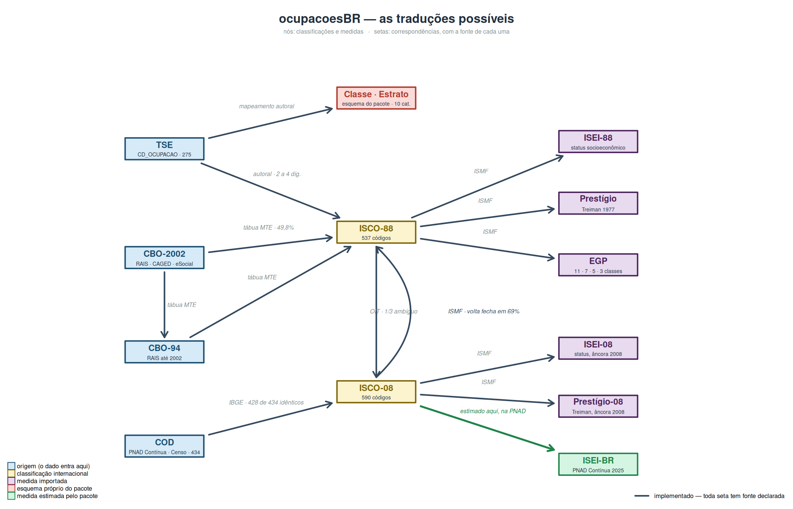

<!-- index.md é GERADO. Edite index.Rmd e rode: Rscript -e 'knitr::knit("index.Rmd")' -->


<div class="ocb-hero">
<div class="ocb-wrap ocb-hero-grid">
<div class="ocb-hero-text">

<span class="ocb-kicker">Pacote R · dado eleitoral brasileiro</span>

<h1>Da ocupação declarada ao TSE à posição social</h1>

<p class="ocb-lead">Traduz o código de ocupação das candidaturas em ISCO-88 e
ISCO-08, e daí em ISEI, prestígio de Treiman, EGP e um esquema de classes
desenhado para o dado eleitoral. Também entra pela CBO da RAIS e pela COD da
PNAD.</p>

<div class="ocb-install">

```r
remotes::install_github("moraespeixoto/ocupacoesBR")
```

</div>

<div class="ocb-cta">
<a class="ocb-btn ocb-btn-laranja" href="articles/comece-aqui.html">Comece aqui</a>
<a class="ocb-btn ocb-btn-claro" href="articles/qual-regua.html">Qual régua usar?</a>
<a class="ocb-btn ocb-btn-nu" href="reference/index.html">Referência</a>
</div>

<div class="ocb-badges">
<a class="ocb-badge-img" href="https://github.com/moraespeixoto/ocupacoesBR/actions/workflows/R-CMD-check.yaml"></a>
<span class="ocb-badge"><span class="ocb-badge-k">licença</span><span class="ocb-badge-v">MIT</span></span>
<span class="ocb-badge"><span class="ocb-badge-k">cadastro TSE</span><span class="ocb-badge-v">1998–2026</span></span>
<span class="ocb-badge"><span class="ocb-badge-k">idioma</span><span class="ocb-badge-v">pt-BR</span></span>
</div>

</div>
<div class="ocb-hero-arte">

</div>
</div>
</div>

<div class="ocb-wrap ocb-secao ocb-duas-colunas">
<div>

<span class="ocb-kicker ocb-kicker-laranja">O uso normal</span>

<h2>Uma linha, e o banco ganha uma coluna</h2>

Você passa a coluna inteira de códigos e recebe a coluna traduzida, alinhada
linha a linha. Não há loop nem tradução código a código, e o banco não muda de
tamanho.

Cada régua é uma função, e cada função é uma coluna nova. Como todas são
vetorizadas puras, elas cabem no mesmo `mutate()`, em qualquer ordem, e o
pipeline não sai do dplyr. O artigo [Com o tidyverse](articles/tidyverse.html)
percorre um pipeline inteiro assim.

O `ano` também é uma coluna, e é o que resolve a quebra de cadastro de 2002: em
1998 o código 214 era delegado de polícia, e hoje é escultor e pintor. Sem o
ano, aquela linha receberia calada o escore de escultor. Com ele, o pacote
devolve `NA` e avisa.

</div>
<div class="ocb-terminal">
<div class="ocb-terminal-barra"><span class="ocb-ponto ocb-ponto-l"></span><span class="ocb-ponto ocb-ponto-a"></span><span class="ocb-ponto ocb-ponto-v"></span><span class="ocb-terminal-nome">R</span></div>


``` r
library(dplyr)
library(ocupacoesBR)

dados |>
  mutate(
    isco  = tse_para_isco(CD_OCUPACAO, ano = ANO_ELEICAO),
    isei  = tse_para_isei(CD_OCUPACAO, ano = ANO_ELEICAO),
    prest = tse_para_prestigio(CD_OCUPACAO, ano = ANO_ELEICAO),
    egp   = tse_para_egp(CD_OCUPACAO, ano = ANO_ELEICAO,
                         avisar = FALSE),
    classe = tse_para_classe(CD_OCUPACAO, ano = ANO_ELEICAO)
  ) |>
  select(-DS_CARGO) |>
  glimpse()
#> Warning: There were 5 warnings in `mutate()`.
#> The first warning was:
#> ℹ In argument: `isco = tse_para_isco(CD_OCUPACAO, ano =
#>   ANO_ELEICAO)`.
#> Caused by warning:
#> ! 1 candidatura(s) usam código(s) que o TSE REUTILIZOU depois (214): naquele ano designavam outra ocupação, e voltam NA.
#> Veja ?tse_vigencia.
#> ℹ Run `dplyr::last_dplyr_warnings()` to see the 4 remaining
#>   warnings.
#> Rows: 5
#> Columns: 7
#> $ ANO_ELEICAO <int> 2026, 2026, 2026, 2026, 1998
#> $ CD_OCUPACAO <chr> "131", "601", "298", "999", "214"
#> $ isco        <chr> "2421", "6100", NA, NA, NA
#> $ isei        <dbl> 85, 23, NA, NA, NA
#> $ prest       <dbl> 73, 38, NA, NA, NA
#> $ egp         <chr> "I: dirigentes e profissionais superiore…
#> $ classe      <chr> "Profissionais de nível superior", "Trab…
```

</div>
</div>

<div class="ocb-wrap ocb-secao">

<span class="ocb-kicker">Quatro portas de entrada</span>

<h2>Cada fonte brasileira tem a sua porta, e todas levam ao mesmo lugar</h2>

<div class="ocb-grid-4">

<div class="ocb-card ocb-card-tse">
<h3>TSE</h3>
<p>O código de ocupação das candidaturas, de 1998 a 2026. A única ponte autoral do pacote, com régua de qualidade em cada linha.</p>
<code class="ocb-assinatura">tse_para_*()</code>
</div>

<div class="ocb-card ocb-card-cbo">
<h3>CBO</h3>
<p>A Classificação Brasileira de Ocupações da RAIS, do CAGED e do eSocial, pela tábua oficial do Ministério do Trabalho. CBO-2002 e CBO-94.</p>
<code class="ocb-assinatura">cbo2002_para_*()</code>
</div>

<div class="ocb-card ocb-card-cod">
<h3>COD</h3>
<p>A classificação da PNAD Contínua e do Censo, construída sobre a ISCO-08. É por aqui que se compara candidatura com população.</p>
<code class="ocb-assinatura">cod_para_*()</code>
</div>

<div class="ocb-card ocb-card-isco">
<h3>ISCO</h3>
<p>Para quem já tem o código internacional e quer só a medida, ou precisa atravessar da ISCO-88 para a ISCO-08 e voltar.</p>
<code class="ocb-assinatura">isco88_para_*()</code>
</div>

</div>
</div>

<div class="ocb-wrap ocb-secao">

<span class="ocb-kicker ocb-kicker-laranja">Quatro réguas, que não são intercambiáveis</span>

<h2>O pacote entrega todas com a mesma facilidade. Escolher é com você.</h2>

<div class="ocb-grid-4">

<div class="ocb-card-escuro">
<span class="ocb-tag">16 – 90</span>
<h3>ISEI</h3>
<p>Índice socioeconômico de Ganzeboom, De Graaf e Treiman. Contínuo, somável, o padrão da pesquisa comparada de estratificação. Vem em três estimações: as âncoras de 1988 e de 2008, importadas, e a brasileira, que o pacote estima na PNAD Contínua e que não substitui as outras.</p>
</div>

<div class="ocb-card-escuro">
<span class="ocb-tag">Treiman, 1977</span>
<h3>Prestígio</h3>
<p>Escala de prestígio ocupacional comparativa. Mede reputação, não recurso; as duas se separam em ocupações inteiras.</p>
</div>

<div class="ocb-card-escuro">
<span class="ocb-tag">11 · 7 · 5 · 3 classes</span>
<h3>EGP</h3>
<p>Erikson-Goldthorpe-Portocarero, portado das sintaxes do ISMF — o mapeamento de Ganzeboom e Treiman sobre a ISCO-88. Exige posição no emprego, que o pacote preenche pelo dicionário, e número de subordinados, que o TSE não pergunta: o pacote avisa.</p>
</div>

<div class="ocb-card-escuro ocb-card-teal">
<span class="ocb-tag">esquema do pacote</span>
<h3>Classe e estrato</h3>
<p>Desenhado para o que o cadastro do TSE de fato registra, inclusive o político profissional e o vínculo público não especificado.</p>
</div>

</div>
</div>

<div class="ocb-faixa-clara">
<div class="ocb-wrap ocb-secao">

<div class="ocb-titulo-linha">
<div>

<span class="ocb-kicker">Por onde começar</span>

<h2>Seis artigos, e o primeiro importa mais que a documentação de qualquer função</h2>

</div>
<a class="ocb-link-forte" href="articles/index.html">Todos os artigos →</a>
</div>

<div class="ocb-grid-3">

<a class="ocb-card-artigo" href="articles/comece-aqui.html">
<span class="ocb-etiqueta ocb-etiqueta-laranja">Comece aqui</span>
<h3>Da ocupação declarada à posição social</h3>
<p>O percurso inteiro em uma sessão, com códigos reais do TSE, e a tabela que mostra onde cada medida responde e onde ela se abstém.</p>
</a>

<a class="ocb-card-artigo" href="articles/tidyverse.html">
<span class="ocb-etiqueta">No pipe</span>
<h3>Com o tidyverse</h3>
<p>O percurso inteiro dentro de um mutate(): uma coluna por régua, across(), a junção com o dicionário e a checagem de cobertura antes de analisar.</p>
</a>

<a class="ocb-card-artigo" href="articles/qual-regua.html">
<span class="ocb-etiqueta">Escolher a medida</span>
<h3>Qual régua responde à sua pergunta</h3>
<p>Quatro medidas, nenhuma intercambiável, e os erros que as pessoas cometem, na ordem em que os cometem.</p>
</a>

<a class="ocb-card-artigo" href="articles/validacao.html">
<span class="ocb-etiqueta">Validar</span>
<h3>A medida se sustenta?</h3>
<p>Patrimônio declarado e escolaridade como critério externo, que não entram na construção da medida.</p>
</a>

<a class="ocb-card-artigo" href="articles/percursos.html">
<span class="ocb-etiqueta">Percursos</span>
<h3>Onde cada tradução se interrompe</h3>
<p>Os pontos de ruptura dos percursos: a ambiguidade da ponte, o empate, a agregação e o resíduo.</p>
</a>

<a class="ocb-card-artigo" href="articles/safra-2026.html">
<span class="ocb-etiqueta">A eleição em curso</span>
<h3>A safra de 2026, na régua</h3>
<p>Nenhum código novo: os 210 códigos declarados em 2026 são subconjunto dos 275 que o pacote já cobria.</p>
</a>


</div>
</div>
</div>

<div class="ocb-wrap ocb-secao ocb-mapa">
<div>

<span class="ocb-kicker">O mapa das traduções</span>

<h2>Cada seta tem fonte declarada</h2>

As tábuas de conversão derivam das sintaxes publicadas do *International
Stratification and Mobility File*, de Ganzeboom e Treiman, e da tábua oficial do
Ministério do Trabalho. São geradas por script a partir dos arquivos originais,
nunca transcritas à mão.

A do TSE para a ISCO-88 é a única autoral. É por isso que ela carrega os rótulos
e a régua de qualidade: é a parte que ninguém pode conferir contra um documento
oficial.

<a class="ocb-link-forte" href="reference/index.html#as-tabelas">Ver as tabelas na referência →</a>

</div>
<div class="ocb-moldura">

</div>
</div>

<div class="ocb-faixa-escura">
<div class="ocb-wrap ocb-secao ocb-publicacoes">
<div>

<span class="ocb-kicker ocb-kicker-ciano">Publicações</span>

<h2>O que foi construído com o pacote</h2>

<p>O artigo de método é o lugar onde as escolhas são justificadas, e não apenas
descritas. Os trabalhos empíricos usam o pacote como instrumento de medida.</p>

<a class="ocb-link-pessego" href="articles/publicacoes.html">Como citar o pacote e as réguas →</a>

</div>
<div class="ocb-lista-pub">

<div class="ocb-pub">
<span class="ocb-etiqueta ocb-etiqueta-pessego">Artigo de método</span>
<p>Peixoto, V. (2026). Da ocupação declarada à posição social: as decisões de medida do pacote ocupacoesBR.</p>
<div class="ocb-pub-meta"><a href="https://doi.org/10.31235/osf.io/b29kg_v1">doi:10.31235/osf.io/b29kg_v1</a><span>SocArXiv, 2026</span></div>
</div>

<div class="ocb-pub">
<span class="ocb-etiqueta ocb-etiqueta-ciano">Trabalho empírico</span>
<p>Peixoto, V. (2026). Os três corpos de uma eleição: eleitorado, candidaturas e eleitos no Brasil (1998–2026).</p>
<div class="ocb-pub-meta"><a href="https://doi.org/10.31235/osf.io/57xp6_v1">doi:10.31235/osf.io/57xp6_v1</a><span>SocArXiv, 2026</span></div>
</div>

<div class="ocb-pub">
<span class="ocb-etiqueta ocb-etiqueta-ciano">Trabalho empírico</span>
<p>Peixoto, V. (2026). As duas faces da classe no recrutamento político brasileiro.</p>
<div class="ocb-pub-meta"><a href="https://doi.org/10.31235/osf.io/muxf8_v1">doi:10.31235/osf.io/muxf8_v1</a><span>SocArXiv, 2026</span></div>
</div>

<div class="ocb-pub">
<span class="ocb-etiqueta ocb-etiqueta-ciano">A fonte das réguas</span>
<p>Ganzeboom, H. B. G. e Treiman, D. J. (1996). Internationally comparable measures of occupational status for the 1988 ISCO. <i>Social Science Research</i>, 25(3), 201–239.</p>
<div class="ocb-pub-meta"><a href="https://doi.org/10.1006/ssre.1996.0010">doi:10.1006/ssre.1996.0010</a></div>
</div>

</div>
</div>
</div>

<div class="ocb-wrap ocb-secao ocb-rodape">
<div>
<h3>Ao usar o ocupacoesBR, cite o pacote e a fonte das escalas</h3>
<p>O pacote é o veículo, não a fonte. As réguas vêm do <i>International
Stratification and Mobility File</i>, que Ganzeboom e Treiman mantêm há três
décadas e pedem citação expressa.</p>
<p>O ISEI-BR é a exceção, e pede três citações: o pacote, porque a estimação é
dele; Ganzeboom, De Graaf e Treiman (1992), pelo método; e o IBGE, pela PNAD
Contínua trimestral de 2025, que é o dado.</p>


```
Peixoto V (2026). _ocupacoesBR: Traduz a Ocupacao
Declarada ao TSE em Classificacoes Padronizadas_. R
package version 0.8.0,
<https://github.com/moraespeixoto/ocupacoesBR>.
```

</div>
<div class="ocb-rodape-links">
<div>
<span class="ocb-rodape-titulo">Pacote</span>
<a href="reference/index.html">Referência</a>
<a href="news/index.html">Novidades (0.8.0)</a>
<a href="https://github.com/moraespeixoto/ocupacoesBR">Código-fonte</a>
<a href="https://github.com/moraespeixoto/ocupacoesBR/issues">Reportar um erro</a>
</div>
<div>
<span class="ocb-rodape-titulo">Ler</span>
<a href="articles/comece-aqui.html">Comece aqui</a>
<a href="articles/qual-regua.html">Qual régua</a>
<a href="articles/validacao.html">Validação</a>
<a href="articles/safra-2026.html">Safra 2026</a>
</div>
<div>
<span class="ocb-rodape-titulo">Autor</span>
<span>Vitor Peixoto</span>
<span>UENF</span>
<a href="LICENSE.html">Licença MIT</a>
</div>
</div>
</div>
