```{r, include = FALSE}
knitr::opts_chunk$set(collapse = TRUE, comment = "#>")
library(ocupacoesBR)
```

Toda candidatura registrada no Tribunal Superior Eleitoral declara uma ocupação.
Ela chega como um número entre 100 e 999, sem escala, sem ordem e sem sentido
fora do próprio cadastro. Este pacote existe para transformar esse número em
alguma coisa que se possa somar, comparar entre eleições e confrontar com a
literatura internacional.

O percurso tem sempre a mesma forma: o código do TSE vira um código da
Classificação Internacional Uniforme de Ocupações, e é dela que saem as medidas.



## A tabela que resume o pacote

Oito das ocupações mais declaradas nas candidaturas brasileiras, passando por
todas as portas de uma vez:

```{r tabela-central}
cods <- c("601", "131", "257", "278", "298", "169", "581", "923")

data.frame(
  cod     = cods,
  rotulo  = tse_para_rotulo(cods),
  isco    = tse_para_isco(cods),
  isei    = tse_para_isei(cods),
  presti  = tse_para_prestigio(cods),
  egp     = as.character(tse_para_egp(cods)),
  classe  = as.character(tse_para_classe(cods, ano = rep(2026L, length(cods))))
)
```

O aviso que apareceu junto não é ruído: o EGP distingue quem supervisiona de
quem não supervisiona, e o cadastro do TSE não registra isso. O pacote calcula
assim mesmo, mas diz o que ficou indeterminado. Nenhuma função deste pacote
devolve um número em silêncio quando sabe que ele está incompleto.

Vale demorar nesta tabela, porque ela contém quase tudo o que é preciso saber
antes de usar o pacote.

As quatro primeiras linhas se comportam como se espera: agricultor, advogado,
empresário e vereador recebem um ISCO, um ISEI, um prestígio, uma classe do
EGP e uma classe do esquema eleitoral. As três últimas não. Servidor público
municipal, dona de casa e aposentado saem com `NA` no ISEI, no prestígio e no
EGP, e mesmo assim recebem uma classe.

Isso não é falha de cobertura. É o desenho da medida. "Servidor público
municipal" não nomeia ocupação alguma: nomeia um vínculo. Dentro dele há o
médico da rede e o gari, e não existe escore honesto que sirva para os dois. O
ISEI se cala porque não sabe, e o esquema de classes responde outra coisa —
que a pessoa tem vínculo público não especificado, o que é uma informação
verdadeira e útil.

A regra que decorre disso: **o `NA` do ISEI é informação, não buraco**. Quem o
substitui por zero, pela média, ou quem elimina essas linhas da análise, está
descartando justamente as candidaturas mais numerosas.

```{r peso-do-na}
r <- tse_ocupacao_rotulos
sem_isei <- suppressWarnings(is.na(tse_para_isei(r$cod_tse)))
round(100 * sum(r$n[sem_isei]) / sum(r$n), 1)
```

`r round(100 * sum(tse_ocupacao_rotulos$n[suppressWarnings(is.na(tse_para_isei(tse_ocupacao_rotulos$cod_tse)))]) / sum(tse_ocupacao_rotulos$n), 1)`% de todas as candidaturas de 1998 a 2026
estão em códigos sem ISEI. Jogá-las fora não é um detalhe metodológico.

## As quatro portas de entrada

O TSE é a porta principal, mas não é a única. O pacote também traduz a
Classificação Brasileira de Ocupações, que é o que a RAIS, o CAGED e o eSocial
usam, e a classificação de ocupações do IBGE, que é o que está na PNAD Contínua
e no Censo.


### Pelo TSE

```{r porta-tse}
tse_para_isei(c("131", "601", "999"))
```

O `999` é a categoria residual "OUTROS", e é a mais declarada de todas. Ela sai
como `NA` por construção.

### Pela CBO-2002

```{r porta-cbo}
cbo2002_para_isco(c("252105", "782305"))
cbo2002_para_isei(c("252105", "782305"))
```

### Pela CBO-94

```{r porta-cbo94}
cbo94_para_isei(c("09220", "98140"))
```

A CBO-94 chega à ISCO-88 e para aí: não existem `cbo94_para_isei08()` nem
`cbo94_para_prestigio08()`. A assimetria é da tábua de conversão, não do pacote,
e está marcada no diagrama acima em vez de escondida.

### Pelo IBGE

```{r porta-cod}
cod_para_isco08(c("2211", "6111"))
cod_para_isei08(c("2211", "6111"))
```

## O último passo, que não é opcional

Antes de qualquer análise, verifique quanto do seu vetor a régua alcança:

```{r cobertura}
cods_2026 <- unique(tse_ocupacao_rotulos$cod_tse[tse_ocupacao_rotulos$ate == 2026])
checa_cobertura(cods_2026)
```

A função devolve `TRUE` ou `FALSE` e imprime o diagnóstico. Se a cobertura
estiver baixa, o problema quase sempre está no formato do código — zeros à
esquerda perdidos numa leitura de CSV, ou um fator convertido para inteiro.

## Onde continuar

Os percursos, com o que acontece quando a tradução é ambígua, estão em
[Os percursos](percursos.html). A escolha entre ISEI, prestígio, EGP e o
esquema de classes está na vinheta
[Qual régua responde à sua pergunta](qual-regua.html), e é a leitura mais
importante antes de publicar qualquer coisa feita com este pacote.
