```{r, include = FALSE}
knitr::opts_chunk$set(collapse = TRUE, comment = "#>")
library(ocupacoesBR)
```

Uma tradução que sempre devolve uma resposta é uma tradução que mente em algum
lugar. Este artigo percorre os quatro caminhos do pacote e mostra, em cada um,
onde ele para e por quê.

## A ponte entre as duas ISCO

A Organização Internacional do Trabalho revisou a ISCO-88 em 2008, e a revisão
não é uma renumeração: ocupações foram fundidas, separadas e movidas de grande
grupo. A tábua do *International Stratification and Mobility File* registra
essas mudanças, e em boa parte dos casos um código antigo tem mais de um
destino possível.


```{r ambiguidade}
table(isco88_isco08$n_alternativas > 1)
```

São `r sum(isco88_isco08$n_alternativas > 1)` códigos ambíguos em
`r nrow(isco88_isco08)`. A função devolve, por padrão, apenas o destino
escolhido:

```{r ponte-simples}
isco88_para_isco08("1229")
```

E devolve a marca junto quando ela é pedida:

```{r ponte-marcada}
isco88_para_isco08("1229", com_ambiguidade = TRUE)
```

O `com_ambiguidade` não muda a tradução. Ele diz quanta confiança ela merece, e
existe para que a incerteza possa entrar na análise em vez de desaparecer nela.

## A escada da CBO, e o empate

O dado administrativo brasileiro é sujo de um jeito específico: o código de seis
dígitos da CBO-2002 aparece truncado em quatro, ou aparece com um sufixo que a
tábua oficial não conhece. O pacote tem duas respostas para isso, e elas fazem
coisas diferentes.



O `empate` decide o que fazer quando a entrada é uma família de quatro dígitos e
as ocupações dessa família não concordam num único ISCO:

```{r empate}
empatadas <- cbo2002_familia_isco88$familia[cbo2002_familia_isco88$empate]
length(empatadas)

suppressWarnings(cbo2002_para_isco(empatadas[1:3]))
cbo2002_para_isco(empatadas[1:3], empate = "moda")
```

O padrão é `"na"`, e é o padrão certo: numa família empatada a tábua não sabe, e
`"moda"` é uma escolha do analista, que deve ser declarada.

A `escada` é outra coisa. Ela só age sobre o que já saiu `NA`, e sobe a
hierarquia da classificação até achar um prefixo que a tábua conheça:

```{r escada}
# códigos no formato da RAIS que não estão na tábua ocupação a ocupação
fora <- paste0(substr(cbo2002_isco88$cbo2002[1:40], 1, 4), "99")

sum(!is.na(suppressWarnings(cbo2002_para_isco(fora))))
sum(!is.na(cbo2002_para_isco(fora, escada = TRUE)))
```

Quarenta códigos que a tradução direta não resolve, e a escada resolve trinta e
três. Os sete restantes continuam `NA`, porque nem o prefixo de dois dígitos
está na tábua. O preço dos trinta e três é a perda de resolução, e ele fica
registrado: `crosswalk_cbo2002()` devolve a coluna `nivel_usado`, que diz em que
degrau cada tradução foi obtida.

```{r nivel-usado}
cw <- crosswalk_cbo2002(fora, escada = TRUE)
table(cw$nivel_usado, useNA = "ifany")
```

## A quebra de 2002 no cadastro do TSE

O TSE reformou o cadastro de ocupações entre a eleição de 2000 e a de 2002, e a
reforma reaproveitou números. O código 214 era delegado de polícia até 2000; a
partir de 2002 é escultor e pintor.

```{r quebra}
tse_quebra_2002[tse_quebra_2002$tipo == "reutilizado",
                c("cod_tse", "rotulo_ate_2000", "rotulo_apos_2002")]
```

Por isso todas as funções da porta do TSE aceitam `ano`:

```{r ano}
tse_para_isei("214")
tse_para_isei(c("214", "214"), ano = c(1998L, 2026L))
```

Sem o `ano`, o pacote aplica o cadastro atual a tudo, e uma série de 1998 a 2026
que passe por qualquer um desses códigos descreve uma trajetória que nunca
existiu. O `checa_periodo()` avisa quando o vetor de códigos toca a quebra.

## A categoria residual

Nenhum dos percursos acima resolve o problema maior, que é anterior a todos
eles: a ocupação mais declarada nas candidaturas brasileiras é "OUTROS".

```{r residual}
r <- tse_ocupacao_rotulos
round(100 * sum(r$n[r$cod_tse == "999"]) / sum(r$n), 1)
```

`r round(100 * sum(tse_ocupacao_rotulos$n[tse_ocupacao_rotulos$cod_tse == "999"]) / sum(tse_ocupacao_rotulos$n), 1)`% de todas as
candidaturas de 1998 a 2026. O pacote devolve `NA` para ela, e nenhuma escada,
nenhum desempate e nenhuma ponte muda isso. É o limite do dado, e ele é
declarado em vez de preenchido.
